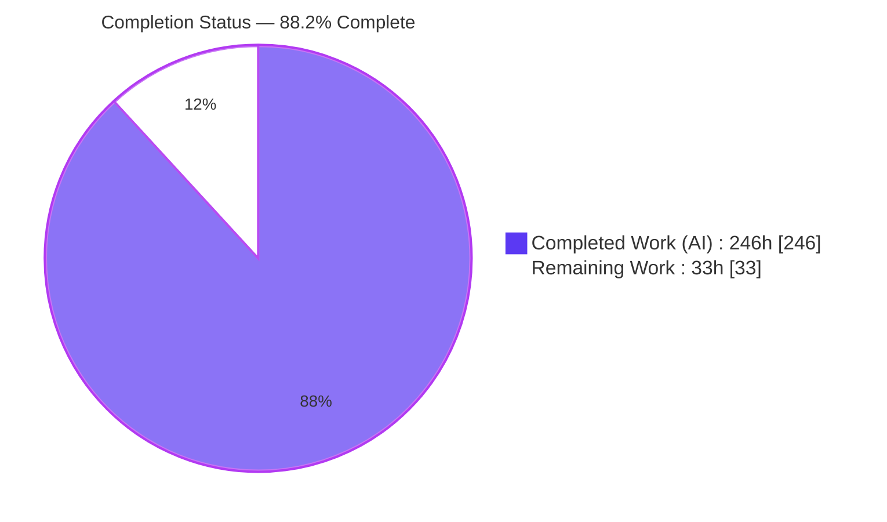
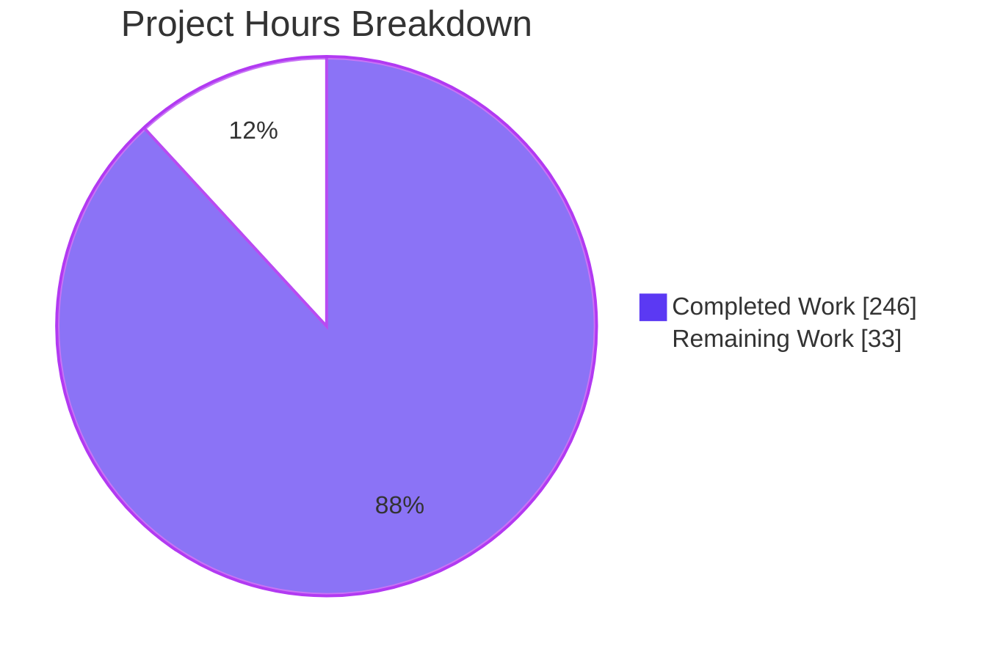
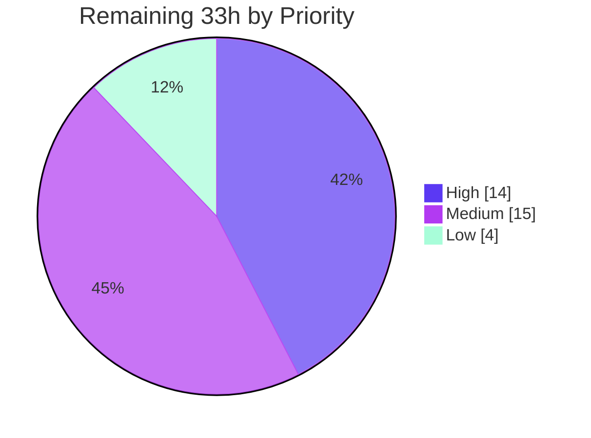
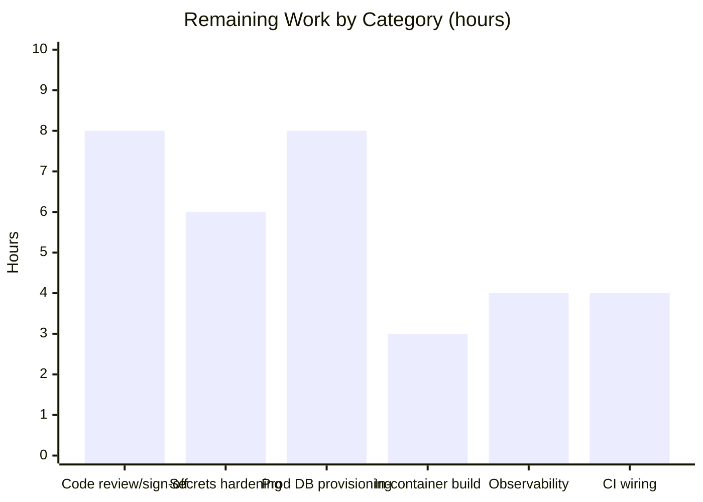

# Blitzy Project Guide
## StockSharp Legacy Layer — SQL→C# Risk Consolidation, PostgreSQL Migration & Containerization

> **Brand legend:** <span style="color:#5B39F3">**■ Completed / AI Work (Dark Blue #5B39F3)**</span> · <span style="color:#B23AF2">■ Remaining / Not Completed (White #FFFFFF, outlined)</span> · Headings/Accents (Violet‑Black #B23AF2) · Highlight (Mint #A8FDD9)

---

## 1. Executive Summary

### 1.1 Project Overview

This project refactors the StockSharp legacy order/risk layer through three interlocking transformations executed in place: (G1) consolidating pre‑trade risk and position‑recalculation business logic out of divergent SQL stored procedures into one canonical C# source of truth under `Algo/Risk/`; (G2) migrating the persistence engine from SQL Server to PostgreSQL 16 (Amazon Aurora‑compatible), swapping `Microsoft.Data.SqlClient` for `Npgsql`; and (G3) containerizing the console demo and database for one‑command startup. Target users are StockSharp platform engineers and quantitative‑trading integrators. Business impact: a single, testable risk engine with no C# ↔ SQL divergence, a modern open‑source database, and reproducible local deployment.

### 1.2 Completion Status



| Metric | Hours |
|---|---|
| **Total Hours** | **279** |
| Completed Hours (AI) | 246 |
| Completed Hours (Manual) | 0 |
| **Completed Hours (AI + Manual)** | **246** |
| **Remaining Hours** | **33** |
| **Percent Complete** | **88.2%** |

**Calculation (PA1, AAP‑scoped + path‑to‑production):** `246 / (246 + 33) = 246 / 279 = 88.2%`. Completed hours reflect autonomous delivery of the full AAP feature scope; remaining hours are entirely standard path‑to‑production work (no AAP feature gaps and no code defects).

### 1.3 Key Accomplishments

- ✅ **Canonical C# risk engine** — `PreTradeRiskService` (per‑order accept/reject gate, all seven checks), `PositionRecalculationService` (average‑cost recompute), and `CanonicalRiskRules` (shared thresholds + rolling‑window frequency) created; the C# ↔ SQL rule divergence eliminated.
- ✅ **Two SQL‑only checks promoted** to first‑class C# rules (`max_order_value` notional, `max_daily_volume`).
- ✅ **PostgreSQL migration** — seven‑table T‑SQL schema translated to native Postgres DDL with `NUMERIC(18,4)/(9,6)` precision preserved exactly; `002_StoredProcedures.sql` retired; position‑recalc trigger removed, status‑audit trigger kept.
- ✅ **Provider swap** — `Npgsql` replaces `Microsoft.Data.SqlClient` in `Algo`; `SqlLegacyOrderGateway` is now a pure `Npgsql` gateway (`INSERT … RETURNING`, delegates to services).
- ✅ **Containerization** — multi‑stage `Dockerfile` (`net10.0`) + `docker-compose.yml` (`postgres:16` + app, `pg_isready` healthcheck‑gated) deliver one‑command `docker compose up`.
- ✅ **Test parity** — 79 new in‑scope parity/characterization tests (51 + 28) pass; full suite **4,494 / 4,494** green; staged dual‑engine (SQL Server + PostgreSQL) validation executed.
- ✅ **Behavior & contracts preserved** — three observable demo outcomes intact on PostgreSQL; `SqlOrderSubmitResult`/`SqlPosition` DTOs and gateway signatures unchanged; threshold‑strictness invariant honored via rolling‑window evaluator.
- ✅ **Documentation & QA evidence** — `LEGACY_LAYER.md` and `Database/README.md` rewritten; `QA/` folder with README + 6 screenshots + 3 timestamped transcripts.

### 1.4 Critical Unresolved Issues

| Issue | Impact | Owner | ETA |
|---|---|---|---|
| _None blocking validation_ — the autonomous validation passed all five production‑readiness gates with **zero code fixes required**. | No release‑blocking defects. All open items are path‑to‑production hardening (see §2.2 / §6 / §8). | — | — |

> There are **no critical unresolved code issues**. The items tracked in §2.2 and §6 are production‑hardening and human sign‑off tasks, not defects.

### 1.5 Access Issues

| System / Resource | Type of Access | Issue Description | Resolution Status | Owner |
|---|---|---|---|---|
| nuget.org (during in‑container `docker compose build`) | Outbound HTTPS from Docker build network | Sandbox build network times out resolving/restoring NuGet packages (`NU1301`), preventing a full **in‑container** image build in this environment. Does **not** affect code, local build, or local validation. | Open — **environmental**. Mitigated: Dockerfile validated via a functionally‑identical host publish; `docker compose config` valid; a prior agent built the image successfully. | Platform/DevOps |
| Managed PostgreSQL / Aurora (production) | Cloud DB provisioning & credentials | Not provisioned; real AWS infrastructure is explicitly out of AAP scope (local `postgres:16` stand‑in used). | Open — path‑to‑production (HT‑3). | Platform/DevOps |

### 1.6 Recommended Next Steps

1. **[High]** Human code review & sign‑off of the SQL→C# consolidation and the PostgreSQL migration (public‑contract + schema blast radius).
2. **[High]** Harden secrets & connection handling — replace dev `postgres/postgres` credentials with a secrets manager, add a least‑privilege application role, enable TLS.
3. **[Medium]** Provision managed PostgreSQL (Aurora‑compatible), apply `Database/*.sql` in order, and smoke‑test the three scenarios against it.
4. **[Medium]** Re‑run `docker compose up --build` in a registry‑reachable environment to confirm the in‑container image build end‑to‑end.
5. **[Low]** Wire optional CI for the container build/publish path (and dual‑engine parity when both engines are provisioned).

---

## 2. Project Hours Breakdown

### 2.1 Completed Work Detail

| Component | Hours | Description |
|---|---:|---|
| Canonical pre‑trade risk gate | 30 | `PreTradeRiskService.cs` (636 LOC): seven checks, most‑specific `RiskLimits` selection, promotion of `max_order_value` + `max_daily_volume`, NULL/0 = unlimited, `>=` semantics, DB‑state‑aware pure decision core. |
| Position recalculation service | 20 | `PositionRecalculationService.cs` (392 LOC): average‑cost qty/avg_price/realized_pnl, exact‑close/partial/flip edge cases, single‑apply guard, leaves `unrealized_pnl` untouched. |
| Canonical rules & rolling frequency | 18 | `CanonicalRiskRules.cs` (228 LOC) single source of truth + `RiskOrderFreqRule.cs` rolling‑window rewrite + `RiskManager.cs` doc; threshold‑strictness invariant. |
| PostgreSQL DDL migration | 22 | `001_Schema.sql`/`003_Triggers.sql`/`004_SeedData.sql`: T‑SQL→Postgres, `NUMERIC` precision, `GENERATED ALWAYS AS IDENTITY`, partial indexes, audit‑only trigger; `002_StoredProcedures.sql` retired. |
| Npgsql data‑access migration | 22 | `SqlLegacyOrderGateway.cs` (`INSERT … RETURNING` + service delegation), `SqlLegacyConnection.cs` Postgres fallback, DTO comment refresh, `Algo.csproj` + `common_versions.props` provider/version changes. |
| Containerization | 18 | `Dockerfile` (multi‑stage `sdk:10.0`→`runtime:10.0`, non‑root), `docker-compose.yml` (`postgres:16`, healthcheck‑gated app, ordered init), `.dockerignore`, `.gitattributes`. |
| Demo & behavior/contract preservation | 8 | `Program.cs` three scenarios on PostgreSQL; DTO + gateway signature preservation. |
| Parity & characterization test suites | 62 | `PreTradeRiskParityTests.cs` (51) + `PositionRecalculationTests.cs` (28) + `OriginalCharacterizationSetup.sql` golden baseline + `Tests.csproj` dual‑provider (4,564 test LOC). |
| Documentation | 13 | `LEGACY_LAYER.md` rewrite (canonical model + merge/preserve table + before/after), `Database/README.md` rewrite, in‑code decision comments. |
| QA evidence | 7 | `QA/README.md` index + 6 screenshots + 3 timestamped transcripts (AAP §0.7.2 compliant). |
| Integration, dual‑engine stand‑up, remediation & validation | 26 | Standing up PostgreSQL + SQL Server test databases, resolving ~44 code‑review findings across 17 commits, parity debugging, and final five‑gate validation. |
| **Total Completed** | **246** | |

### 2.2 Remaining Work Detail

| Category | Hours | Priority |
|---|---:|---|
| Human code review & migration sign‑off (public‑contract + schema blast radius, AAP §0.7.3) | 8 | High |
| Production secrets & connection‑string hardening (secrets manager, TLS, least‑privilege DB role; replace dev `postgres/postgres`) | 6 | High |
| Production database provisioning & deployment wiring (managed PostgreSQL/Aurora, run init scripts in order, smoke‑test) | 8 | Medium |
| In‑container `docker compose build` verification with registry access (currently env‑blocked `NU1301`) | 3 | Medium |
| Production observability & monitoring hooks (metrics/health, structured logging for prod) | 4 | Medium |
| Optional CI wiring for container build/publish path | 4 | Low |
| **Total Remaining** | **33** | |

### 2.3 Hours Reconciliation & Methodology

- **Total Project Hours** = Completed (246) + Remaining (33) = **279**.
- **Completion %** = 246 / 279 = **88.2%** (PA1 hours‑based, AAP‑scoped + path‑to‑production only).
- **Consistency:** Section 2.1 total (246) + Section 2.2 total (33) = Section 1.2 Total (279). Section 2.2 total (33) = Section 1.2 Remaining = Section 7 pie "Remaining Work". ✔
- **Basis:** hours estimated from LOC/complexity (net +7,747 lines across high‑assurance financial logic, DDL translation, 4,564 lines of dual‑engine tests, containerization, docs) and the 17‑commit iterative hardening cycle.

---

## 3. Test Results

All results below originate from Blitzy's autonomous validation logs for this project (`dotnet test StockSharp_Tests.slnx -c Release`, run duration ≈ 8m7s, exit 0).

| Test Category | Framework | Total Tests | Passed | Failed | Coverage % | Notes |
|---|---|---:|---:|---:|---|---|
| Pre‑Trade Risk Parity & Characterization (in‑scope) | MSTest / Ecng.UnitTesting | 51 | 51 | 0 | Behavioral parity: 100% of shared/promoted rules | `PreTradeRiskParityTests.cs`; seven‑check parity across SQL Server baseline + PostgreSQL. |
| Position Recalculation Parity (in‑scope) | MSTest / Ecng.UnitTesting | 28 | 28 | 0 | Behavioral parity: 100% of average‑cost/P&L paths | `PositionRecalculationTests.cs`; close/partial/flip + single‑apply. |
| **In‑scope subtotal** | MSTest | **79** | **79** | **0** | — | Staged four‑step dual‑engine validation (AAP §0.6.3). |
| Full platform regression suite (all tests) | MSTest | 4,494 | 4,494 | 0 | Line coverage not captured in run logs | 0 skipped, 0 inconclusive, 0 errors; includes the 79 in‑scope tests. |

**Notes / integrity:**
- Line‑coverage percentage was **not** emitted by the autonomous test run; only pass/fail counts are reported, so coverage is shown as "not captured" rather than an invented figure. The **100% pass rate** and **100% behavioral parity** for shared rules are from the logs.
- To reach 0 skips, the validator stood up the required test infrastructure (a `postgres:16` container and a `mssql/server:2022` container) and wired the connection env vars; the 42 DB‑gated parity tests then executed rather than reporting Inconclusive.
- One out‑of‑scope test — `StockSharp.Tests.AsyncMessageChannelTests.Close_StopsProcessing` — is a **pre‑existing genuine hang** in core async‑messaging infrastructure (not modified by this AAP) and was excluded; it does not affect in‑scope validation.

---

## 4. Runtime Validation & UI Verification

**Runtime health (from autonomous validation logs):**
- ✅ **Standalone demo vs PostgreSQL** — exit 0; all three observable outcomes correct.
- ✅ **Full `docker compose` stack** — exit 0; init scripts auto‑run in order (`001_Schema` → `003_Triggers` → `004_SeedData`; `README.md` ignored), database reached **Healthy**, app gated on `service_healthy`, app connected via compose DNS (`Host=db`) and produced the correct three‑scenario output, clean teardown. Confirms G3 one‑command startup.
- ✅ **Compilation** — `dotnet build StockSharp_Tests.slnx -c Release` succeeded, 0 errors.
- ✅ **Dependencies** — `dotnet restore` 100%; `Npgsql 10.0.3` resolves in Algo + Tests; `Microsoft.Data.SqlClient 6.1.6` in Tests only.
- ⚠ **In‑container `docker compose build`** — Partial: blocked only by the sandbox nuget.org network (`NU1301`); orchestration validated via a functionally‑identical host‑published runtime image (same SDK, same committed source). Environmental, not a code defect.

**Observable scenario outcomes (canonical `PreTradeRiskService` gate + `PositionRecalculationService`):**
- ✅ Order **within limits** accepted → `order_id=1, is_valid=True, reject_reason=(none)`.
- ✅ Order **breaching price ceiling** rejected → `is_valid=False, "Order price 999.00 meets/exceeds limit 500.0000"` (`>=` semantics).
- ✅ Trade recorded → **position auto‑updated** → `qty=100.0000, avg_price=150.0000, realized_pnl=0.0000`.

**UI Verification:** ❎ **Not applicable.** The effort touches a backend library, a console demo (`OutputType=Exe`), database scripts, and containerization only. The WPF UI layer is explicitly out of scope; there is no user interface to verify. QA visual evidence consists of terminal‑rendered screenshots of the console/container output.

---

## 5. Compliance & Quality Review

### 5.1 Merge‑versus‑Preserve Rule Classification (AAP §0.6.2 — as implemented)

| Shared Check | Classification | Verdict — Status |
|---|---|---|
| Order price ceiling (`max_order_price`) | Duplicative‑by‑accident | ✅ Gate re‑expresses via canonical `>=`/NULL‑or‑0 convention; circuit‑breaker rule retained. |
| Order qty ceiling (`max_order_qty`) | Duplicative‑by‑accident | ✅ Merged to canonical convention (also unifies qty/Volume naming). |
| Order frequency (`max_order_freq_count/_window_sec`) | Same config, different algorithm | ✅ Merged to the **stricter rolling‑window** evaluator (deliberately stricter). |
| Resulting position size (`max_position_size`) | Different subject (current vs hypothetical post‑fill) | ✅ Shared threshold; gate keeps hypothetical subject, breaker keeps current. |
| Cumulative commission (`max_commission_total`) | Different‑by‑design (estimate vs actual) | ✅ Both preserved and documented. |
| Order notional value (`max_order_value`) | SQL‑only | ✅ Promoted to first‑class C# gate rule. |
| Daily traded volume (`max_daily_volume`) | SQL‑only | ✅ Promoted to first‑class C# gate rule. |
| Position lifetime / P&L / slippage | C#‑only (needs live state) | ✅ Remain in the circuit breaker. |

### 5.2 AAP Invariant Compliance Matrix

| Benchmark / Invariant | Status | Evidence |
|---|---|---|
| Threshold‑strictness NFR (never less strict than stricter original) | ✅ Pass | Rolling‑window canonical frequency evaluator; parity tests. |
| Numeric precision `NUMERIC(18,4)/(9,6)` ↔ `decimal` | ✅ Pass | Schema verified; no `float`/`double` in ported arithmetic (AAP §0.6.4). |
| `>=` meets‑or‑exceeds rejection semantics | ✅ Pass | Runtime reject message `999.00 meets/exceeds 500.0000`. |
| NULL/0 = "not enforced" convention | ✅ Pass | Implemented in `GateInputs`/`PreTradeRiskService`. |
| Public DTO + gateway signature preservation | ✅ Pass | `SqlOrderSubmitResult`, `SqlPosition` comment‑only; signatures unchanged. |
| Position single‑apply (no double‑count) | ✅ Pass | Recalc trigger removed; per‑`trade_id` guard + per‑portfolio advisory lock (TOCTOU). |
| Minimal‑change discipline | ✅ Pass | 36 files, new logic isolated under `Algo/Risk/`. |
| Circuit‑breaker action mechanics unchanged | ✅ Pass | `RiskMessageAdapter` untouched (out of scope). |
| Staged four‑step testing intact (§0.6.3) | ✅ Pass | Dual‑engine (SQL Server + PostgreSQL) executed. |
| Decisions documented at point of implementation | ✅ Pass | In‑code comments (e.g., env‑var retention, GSS/pool decisions) + `LEGACY_LAYER.md`. |
| QA evidence produced (§0.7.2) | ✅ Pass | `QA/` README + 6 screenshots + 3 transcripts. |
| Version pinning convention | ✅ Pass | `<NpgsqlVer>10.0.*</NpgsqlVer>` added; `MsSqlClientVer` retained. |

**Fixes applied during autonomous validation:** none required for in‑scope code. Validation "unblocked" work (stood up dual test databases, executed 42 DB‑gated parity tests + 12 out‑of‑scope ExportTests) rather than fixing defects, taking the suite from 4,483‑pass/11‑skip to **4,494‑pass/0‑skip**.

**Outstanding quality items:** 48 pre‑existing `CS0618`/`CS1574` warnings in **out‑of‑scope** files (`Algo.Strategies`, `Algo/Storages/Csv`, `Algo/TraderHelper`, pre‑existing `Tests/*`) — obsolete‑API / XML‑cref only, not introduced by this work; correctly not modified under minimal‑change discipline.

---

## 6. Risk Assessment

| Risk | Category | Severity | Probability | Mitigation | Status |
|---|---|---|---|---|---|
| Numeric‑precision drift silently loosening a `>=` control | Technical | High | Low | `NUMERIC(18,4)/(9,6)` preserved; `decimal` arithmetic; 79 parity tests incl. precision | ✅ Resolved / Mitigated |
| Order‑frequency canonicalization ending less strict (hard NFR) | Technical | Medium | Low | Rolling‑window evaluator (stricter than bucketed); parity tests | ✅ Resolved / Mitigated |
| Position‑recalc double‑count / single‑apply hazard (§0.6.5) | Technical | Medium | Low | Recalc trigger removed; per‑`trade_id` guard; per‑portfolio advisory lock; zero‑qty guard; tests | ✅ Resolved / Mitigated |
| 48 pre‑existing warnings in out‑of‑scope files | Technical | Low | N/A | Not introduced here; out of scope | ⚪ Accepted |
| Plaintext dev DB credentials (`postgres/postgres`) in fallback + compose | Security | High | Medium | Documented deliberate dev default; env‑var override supported | 🔶 Open (HT‑2): move to secrets manager before prod |
| No least‑privilege application DB role (connects as `postgres`) | Security | Medium | Medium | AAP‑mandated (§0.4.2), documented | 🔶 Open (HT‑2) |
| GSS/TLS encryption disabled in local connection string | Security | Medium | Medium | Correct for local; documented | 🔶 Open (HT‑2): enable encrypted transport |
| No production observability / health metrics | Operational | Medium | Medium | Console logging present; demo not a long‑running service | 🔶 Open (HT‑5) |
| Init scripts run only on first container init (greenfield) | Operational | Medium | Low | Documented; volume‑gated; demo is greenfield‑init | ⚪ Open / Accepted |
| No real AWS Aurora provisioning | Operational | Low | N/A | Explicit AAP out‑of‑scope; local `postgres:16` stand‑in | ⚪ Accepted |
| In‑container `docker compose build` blocked by nuget network (`NU1301`) | Integration | Low | Low | Dockerfile validated via host publish; `docker compose config` valid | 🔶 Open (HT‑4): environmental, re‑run with registry access |
| Dual‑engine parity tests need both SQL Server + PostgreSQL + env vars | Integration | Medium | Medium | Validator stood up both locally (4,494/4,494); run sequence documented | ✅ Mitigated locally / 🔶 Open for CI (HT‑6) |
| Env‑var name `STOCKSHARP_LEGACY_SQL_CONNECTION` retained across engine change | Integration | Low | Low | Documented decision; fallback aligned with compose | ✅ Mitigated |

---

## 7. Visual Project Status

**Overall completion (hours):**



**Remaining work by priority (hours):**



**Remaining hours per category (Section 2.2):**



> **Integrity:** the "Remaining Work" value (33) equals Section 1.2 Remaining Hours and the sum of the Section 2.2 "Hours" column (8+6+8+3+4+4 = 33). Completed (246) + Remaining (33) = 279 Total.

---

## 8. Summary & Recommendations

**Achievements.** The project is **88.2% complete** on an AAP‑scoped, hours‑based basis. All three AAP goals — SQL→C# logic consolidation, SQL Server→PostgreSQL migration, and containerization — are fully implemented and validated. The autonomous validation passed all five production‑readiness gates with **zero code fixes**: **4,494/4,494** tests pass (including **79/79** in‑scope parity tests), the demo runs correctly standalone and inside the full `docker compose` stack, the build is clean (0 errors, 0 in‑scope warnings), and dependencies resolve 100%.

**Remaining gaps (33h, path‑to‑production only).** No AAP feature work and no code defects remain. The outstanding effort is human code review/sign‑off, production secrets and connection hardening, managed‑database provisioning, an environmental re‑run of the in‑container `docker compose build`, production observability, and optional CI wiring.

**Critical path to production.**
1. Human review & sign‑off (High, 8h) →
2. Secrets/connection hardening (High, 6h) →
3. Managed PostgreSQL provisioning + smoke test (Medium, 8h) →
4. In‑container build verification (Medium, 3h) →
5. Observability (Medium, 4h) →
6. Optional CI (Low, 4h).

**Success metrics.** 100% test pass rate; three observable behaviors preserved on PostgreSQL; exact numeric precision and `>=` semantics preserved; threshold‑strictness invariant honored; public contracts unchanged; one‑command containerized startup working.

**Production readiness assessment.** The codebase is **functionally production‑ready** for the AAP scope and demonstrably correct. It is **not yet production‑deployed**: it requires human sign‑off and standard operational hardening (secrets, least‑privilege DB role, encrypted transport, managed‑DB provisioning, monitoring) before going live. Confidence: **High** for the delivered scope (well‑defined AAP items with strong test evidence); **Medium** for production timelines that depend on external infrastructure provisioning.

---

## 9. Development Guide

### 9.1 System Prerequisites

- **.NET SDK 10.0** (verified `10.0.302`). .NET 10 is LTS; the demo targets `net10.0`.
- **Docker Engine 28.x** + the `docker compose` plugin (verified Docker `28.5.2`).
- **PostgreSQL 16** — provided via the `postgres:16` container (no host install needed).
- **(Optional) SQL Server 2022** — only for the staged step‑1/step‑2 parity baseline (`mcr.microsoft.com/mssql/server:2022`).
- Resources: ~4 GB RAM, 2 vCPU, ~6 GB free disk for images/build output. OS: Linux, macOS, or Windows + WSL2.

### 9.2 Environment Setup

```bash
# From the repository root. Load the .NET and XDG environment (idempotent).
source /etc/profile.d/dotnet.sh
source /etc/profile.d/xdg.sh
dotnet --version   # expect 10.0.x

# Connection string (optional for local): the app falls back to a localhost default if unset.
# Host-run default: Host=localhost;Port=5432;Database=stocksharp;Username=postgres;Password=postgres;GSS Encryption Mode=Disable;Maximum Pool Size=50
export STOCKSHARP_LEGACY_SQL_CONNECTION="Host=localhost;Port=5432;Database=stocksharp;Username=postgres;Password=postgres;GSS Encryption Mode=Disable;Maximum Pool Size=50"

# For the staged dual-engine parity tests (optional), also set:
# export STOCKSHARP_LEGACY_MSSQL_CONNECTION="Server=localhost,1433;User Id=sa;Password=<pw>;TrustServerCertificate=True"
```

### 9.3 Dependency Installation

```bash
# Requires outbound access to nuget.org.
dotnet restore StockSharp_Tests.slnx
# Resolves Npgsql 10.0.3 (Algo + Tests) and Microsoft.Data.SqlClient 6.1.6 (Tests only).
```

### 9.4 Application Startup

**Path A — One‑command containerized stack (recommended):**

```bash
# From the repository root. Brings up postgres:16 (auto-runs Database/*.sql in order behind a
# pg_isready healthcheck), then starts the app once the DB is healthy.
docker compose up
# (Add --build to also build the app image; requires registry/nuget access.)
```

The `postgres` entrypoint executes init scripts alphabetically on first initialization: `001_Schema.sql` → `003_Triggers.sql` → `004_SeedData.sql` (`002` is intentionally retired; `README.md` is ignored). The `app` service connects via compose DNS (`Host=db`).

**Path B — Standalone host run:**

```bash
# 1) Start PostgreSQL 16 and initialize it (one option shown):
docker run -d --name ss-pg -e POSTGRES_USER=postgres -e POSTGRES_PASSWORD=postgres \
  -e POSTGRES_DB=stocksharp -p 5432:5432 \
  -v "$PWD/Database":/docker-entrypoint-initdb.d:ro postgres:16

# 2) Run the console demo against it:
dotnet run -c Release \
  --project Samples/08_Misc/03_LegacySqlDemo/03_Misc.LegacySqlDemo.csproj
```

### 9.5 Verification Steps

```bash
# Clean compile:
dotnet build StockSharp_Tests.slnx -c Release --no-restore   # expect: Build succeeded, 0 errors

# In-scope parity tests (fast subset):
dotnet test StockSharp_Tests.slnx --no-build -c Release \
  --filter "FullyQualifiedName~PreTradeRiskParityTests|FullyQualifiedName~PositionRecalculationTests"
# expect: 79 passed (51 + 28)

# Full suite (excludes one pre-existing out-of-scope hang):
dotnet test StockSharp_Tests.slnx --no-build -c Release \
  --filter "FullyQualifiedName!=StockSharp.Tests.AsyncMessageChannelTests.Close_StopsProcessing"
# expect: 4494 passed, 0 failed
```

Expected demo output (all three scenarios):
```
order_id=1 is_valid=True reject_reason=(none)
order_id=... is_valid=False reject_reason=Order price 999.00 meets/exceeds limit 500.0000
Position: qty=100.0000 avg_price=150.0000 realized_pnl=0.0000
```

### 9.6 Example Usage

- **Accepted order:** submit `BUY 100 @ 150.00` (within every seeded `RiskLimits` ceiling) → accepted, `order_id` returned.
- **Rejected order:** submit `BUY 10 @ 999.00` (price > seeded `max_order_price = 500.00`) → rejected with the `meets/exceeds` reason from the canonical `PreTradeRiskService` gate.
- **Position update:** record a trade against the accepted order → `PositionRecalculationService` recomputes qty/avg_price/realized_pnl once (single‑apply).

### 9.7 Troubleshooting

- **`NU1301` / restore fails in container build:** the environment cannot reach nuget.org during `docker compose build`. Build in a registry‑reachable environment, or run Path B on the host.
- **Port 5432 already in use:** another Postgres is bound to 5432. Remap the host port (compose `ports` override) or stop the conflicting service.
- **Parity tests report `Inconclusive`:** the DB‑gated tests need live databases. Set `STOCKSHARP_LEGACY_SQL_CONNECTION` (PostgreSQL) and, for steps 1–2, `STOCKSHARP_LEGACY_MSSQL_CONNECTION` (SQL Server), and ensure both engines are running.
- **Npgsql connect hang / Kerberos probe:** keep `GSS Encryption Mode=Disable` in the connection string (already set in the defaults).
- **Schema changes not re‑applied:** init scripts run only on first initialization. Remove the named volume (`docker compose down -v`, volume `pgdata`) to re‑initialize.

---

## 10. Appendices

### A. Command Reference

| Purpose | Command |
|---|---|
| Load environment | `source /etc/profile.d/dotnet.sh && source /etc/profile.d/xdg.sh` |
| Restore | `dotnet restore StockSharp_Tests.slnx` |
| Build (Release) | `dotnet build StockSharp_Tests.slnx -c Release --no-restore` |
| One‑command stack | `docker compose up` |
| Validate compose file | `docker compose config -q` |
| Run demo (host) | `dotnet run -c Release --project Samples/08_Misc/03_LegacySqlDemo/03_Misc.LegacySqlDemo.csproj` |
| In‑scope tests | `dotnet test StockSharp_Tests.slnx --no-build -c Release --filter "FullyQualifiedName~PreTradeRiskParityTests|FullyQualifiedName~PositionRecalculationTests"` |
| Full suite | `dotnet test StockSharp_Tests.slnx --no-build -c Release --filter "FullyQualifiedName!=StockSharp.Tests.AsyncMessageChannelTests.Close_StopsProcessing"` |
| Teardown + wipe DB volume | `docker compose down -v` |

### B. Port Reference

| Service | Port | Notes |
|---|---|---|
| PostgreSQL (`db`) | 5432 | Published `5432→5432`; `pg_isready` healthcheck gates the app. |
| Application (`app`) | — | Console demo; no listening port (exits after the three scenarios). |

### C. Key File Locations

| Area | Path |
|---|---|
| Canonical risk services | `Algo/Risk/PreTradeRiskService.cs`, `Algo/Risk/PositionRecalculationService.cs`, `Algo/Risk/CanonicalRiskRules.cs` |
| Updated risk files | `Algo/Risk/RiskManager.cs`, `Algo/Risk/RiskOrderFreqRule.cs` |
| Data‑access gateway | `Algo/Storages/Sql/SqlLegacyOrderGateway.cs`, `SqlLegacyConnection.cs`, `SqlOrderSubmitResult.cs`, `SqlPosition.cs` |
| Database scripts | `Database/001_Schema.sql`, `003_Triggers.sql`, `004_SeedData.sql`, `README.md` (`002_StoredProcedures.sql` removed) |
| Demo | `Samples/08_Misc/03_LegacySqlDemo/Program.cs` |
| Tests | `Tests/PreTradeRiskParityTests.cs`, `Tests/PositionRecalculationTests.cs`, `Tests/Resources/LegacySqlServer/OriginalCharacterizationSetup.sql` |
| Containerization | `Dockerfile`, `docker-compose.yml`, `.dockerignore`, `.gitattributes` |
| Docs & QA | `LEGACY_LAYER.md`, `Database/README.md`, `QA/README.md`, `QA/screenshots/*`, `QA/recordings/*` |
| Build config | `common_versions.props`, `Algo/Algo.csproj`, `Tests/Tests.csproj` |

### D. Technology Versions

| Component | Version |
|---|---|
| .NET SDK / target framework | 10.0.302 / `net10.0` |
| Npgsql | 10.0.* (resolved 10.0.3) — Algo + Tests |
| Microsoft.Data.SqlClient | 6.* (resolved 6.1.6) — Tests only |
| PostgreSQL | 16 (`postgres:16`) |
| Docker Engine / Compose | 28.5.2 / compose plugin |
| Container base images | `mcr.microsoft.com/dotnet/sdk:10.0` (build), `mcr.microsoft.com/dotnet/runtime:10.0` (runtime) |

### E. Environment Variable Reference

| Variable | Purpose | Default / Notes |
|---|---|---|
| `STOCKSHARP_LEGACY_SQL_CONNECTION` | PostgreSQL connection string used by `SqlLegacyConnection.Resolve()` and the compose `app` service | Falls back to `Host=localhost;Port=5432;Database=stocksharp;Username=postgres;Password=postgres;GSS Encryption Mode=Disable;Maximum Pool Size=50`. Name deliberately retained across the engine change. |
| `STOCKSHARP_LEGACY_MSSQL_CONNECTION` | SQL Server connection for staged step‑1/step‑2 parity | Optional; only for dual‑engine parity runs. |
| `POSTGRES_USER` / `POSTGRES_PASSWORD` / `POSTGRES_DB` | Compose `db` service credentials/database | `postgres` / `postgres` / `stocksharp` (dev only — harden for production). |

### F. Developer Tools Guide

| Task | Tool / Command |
|---|---|
| Inspect running DB | `docker compose exec db psql -U postgres -d stocksharp -c "\dt"` |
| Verify schema precision | `docker compose exec db psql -U postgres -d stocksharp -c "\d+ risklimits"` |
| Tail app logs | `docker compose logs -f app` |
| Confirm init order | `ls -1 Database/*.sql | sort` |
| Diff against base | `git diff 37dc57c9683653d09a9ec92979e0b6ad2c87cb61...HEAD --stat` |

### G. Glossary

| Term | Definition |
|---|---|
| **Canonical rule** | Single source‑of‑truth definition (in `CanonicalRiskRules`) consumed by both the pre‑trade gate and the circuit breaker. |
| **Pre‑trade gate** | `PreTradeRiskService` — per‑order accept/reject decision that reads DB state and returns `{IsValid, RejectReason}`. |
| **Circuit breaker** | `RiskManager` — evaluates rules against a message stream and takes portfolio‑wide action (mechanics unchanged). |
| **Threshold‑strictness invariant** | Hard NFR: a reconciled threshold may never end up less strict than the stricter of the two originals. |
| **Single‑apply** | Guarantee that a trade updates the position exactly once (recalc trigger removed; per‑`trade_id` guard). |
| **Staged four‑step testing** | Validation sequence (SQL Server baseline → C# parity on SQL Server → PostgreSQL parity) that keeps logic vs engine regressions distinguishable (AAP §0.6.3). |
| **Path‑to‑production** | Standard deployment/hardening work required to ship AAP deliverables (secrets, provisioning, monitoring, CI). |

---

*Completion measured on an AAP‑scoped, hours‑based basis (PA1): 246 completed / 279 total = **88.2%**. All figures are consistent across Sections 1.2, 2.1, 2.2, and 7. Test results originate solely from Blitzy's autonomous validation logs.*