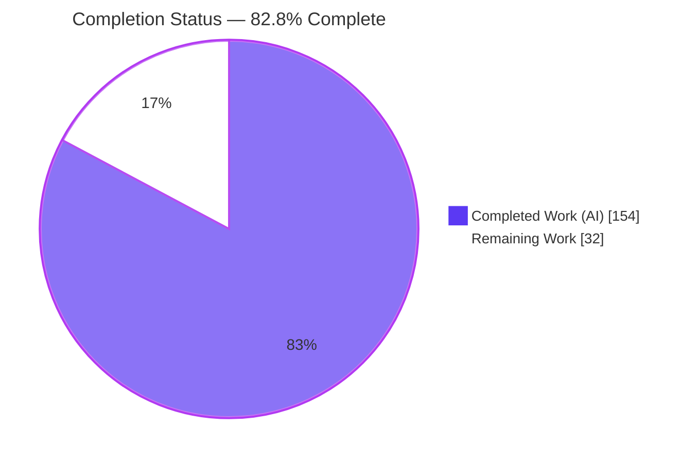
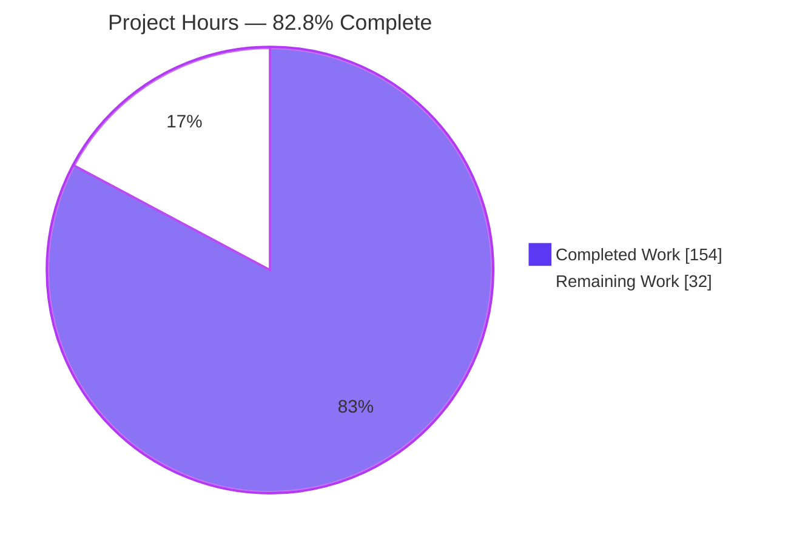
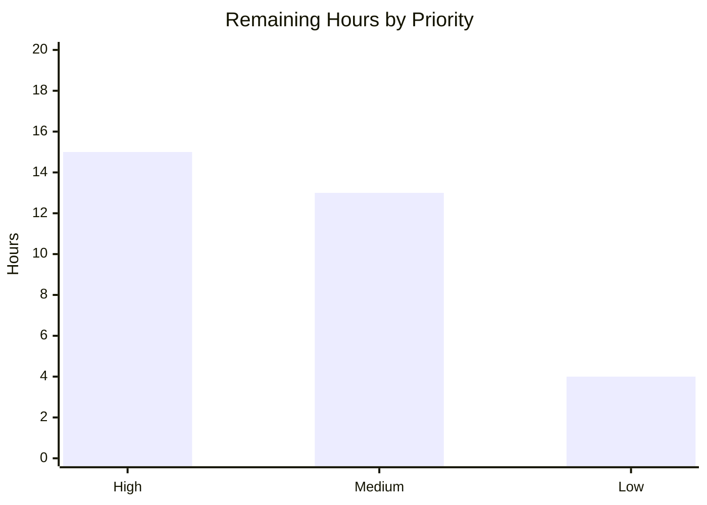

# Blitzy Project Guide
### StockSharp — Risk / Position Logic Consolidation (SQL → C#)

> Brand legend used throughout: **Completed / AI Work** = Dark Blue `#5B39F3` · **Remaining / Not Completed** = White `#FFFFFF` · Headings/Accents = Violet-Black `#B23AF2` · Highlight = Mint `#A8FDD9`.

---

## 1. Executive Summary

### 1.1 Project Overview
This project consolidates all pre-trade risk validation and position/P&L recalculation logic — previously split and unreconciled between a C# `RiskManager` circuit-breaker and SQL Server stored procedures/triggers — into a single, fully-tested C# business-logic layer under `Algo/Risk/`, leaving SQL Server as pure data storage. It targets StockSharp's algorithmic-trading risk subsystem and the developers/operators who maintain it. Every risk rule is now defined exactly once and consumed by two distinct enforcement patterns (a stream-based circuit breaker and a per-order pre-trade gate), eliminating a documented divergence where "nothing ran both." The business impact is a single, auditable source of truth for risk controls, net-new automated test coverage, and a vendor-neutral schema ready for a future engine migration.

### 1.2 Completion Status



| Metric | Value |
|---|---|
| **Total Hours** | **186 h** |
| **Completed Hours (AI + Manual)** | **154 h** (154 AI + 0 manual) |
| **Remaining Hours** | **32 h** |
| **Percent Complete** | **82.8%** (154 ÷ 186) |

> Completion % is AAP-scoped (PA1): `Completed ÷ (Completed + Remaining) × 100`. All AAP implementation deliverables are complete and validated; the remaining 32 h is legitimate path-to-production human work.

### 1.3 Key Accomplishments
- ✅ Introduced canonical C# service layer: `PreTradeRiskService` (per-order gate, 7 rules) and `PositionRecalculationService` (average-cost + realized P&L).
- ✅ Promoted two SQL-only rules to first-class canonical C# rules: `RiskOrderValueRule` (notional) and `RiskDailyVolumeRule`; auto-discovered by `InMemoryRiskRuleProvider` with no wiring edits.
- ✅ Canonicalized order-frequency from fixed-window to **rolling-window** semantics (stricter-wins hard constraint honored).
- ✅ Reduced SQL Server to pure storage — all 3 stored procedures dropped, recalc trigger removed, only `trg_Orders_StatusAudit` retained (verified live: **0 procedures, 7 tables**).
- ✅ Eliminated the position double-count hazard — recompute is a single C# call per trade.
- ✅ Reduced `SqlLegacyOrderGateway` to pure parameterized ADO.NET data access with `sp_getapplock` concurrency hardening.
- ✅ Full rewrite of `LEGACY_LAYER.md` documenting every rule reconciliation decision; inline decision comments at each point of implementation.
- ✅ Net-new automated test coverage: **132/132 tests passing** (104 unit/parity/characterization + 28 live-SQL integration), build clean (0 errors, 22 projects), demo validated end-to-end against a live SQL Server container.

### 1.4 Critical Unresolved Issues
There are **no unresolved issues within the AAP implementation scope** — all deliverables are complete and validated. The items below are path-to-production gaps (not defects in the delivered code) that must be closed before production release.

| Issue | Impact | Owner | ETA |
|---|---|---|---|
| SQL connection uses a dev-fallback SA account + plaintext password | Security exposure if carried to production | Security / Platform | 0.5 day |
| Production SQL Server not yet provisioned (only Docker dev validated) | Cannot deploy without a managed instance + migration run | DevOps | 0.5–1 day |
| Pre-existing out-of-scope `AsyncMessageChannelTests` hangs an unfiltered `dotnet test` | Blocks full-suite CI gating (mitigated today via `--filter`) | Dev (CI) | 0.5 day |
| No production observability wiring for reject reasons / recompute outcomes | Reduced operational visibility | Dev / SRE | 0.5 day |

### 1.5 Access Issues
No access issues were identified during this session. The repository, the .NET SDK toolchain, and a live SQL Server 2022 Docker instance were all reachable, enabling full build, test, and runtime re-verification.

| System/Resource | Type of Access | Issue Description | Resolution Status | Owner |
|---|---|---|---|---|
| Git repository (`stocksharp-storedprocedures`) | Read/Write | None — branch checked out, clean tree | ✅ No issue | — |
| .NET SDK 10.0.302 toolchain | Build/Test | None — restore/build/test operate | ✅ No issue | — |
| SQL Server 2022 (Docker, `localhost,14330`) | DB connection | None — container up; live queries succeeded | ✅ No issue | — |

> Note (forward-looking, not a current blocker): production deployment will require credentials for a managed SQL Server instance and a secret store; these are not needed for the validated development workflow.

### 1.6 Recommended Next Steps
1. **[High]** Human code review & sign-off of the consolidated risk/position layer (risk-critical financial logic; confirm parameterized SQL, stricter-wins, no logic left in SQL).
2. **[High]** Security review & remediation of SQL connection/secrets handling (remove dev fallback; least-privilege login; secret manager / managed identity).
3. **[High]** Provision a production SQL Server instance and apply `001→002→003→004` with a secret-managed connection string.
4. **[Medium]** Integrate RiskTests into CI/CD (provision a SQL Server service for the 28 integration tests) and quarantine the pre-existing `AsyncMessageChannelTests` hang.
5. **[Medium]** Wire production observability (logging/metrics for reject reasons + recompute) and author the deployment/rollback runbook.

---

## 2. Project Hours Breakdown

### 2.1 Completed Work Detail
All rows are AAP-scoped autonomous work delivered and validated. **Total = 154 h.**

| Component | Hours | Description |
|---|---:|---|
| Reconciliation analysis & architecture design | 16 | Rule-by-rule MERGE/RELOCATE/SHARED/KEEP-SEPARATE judgment (Goals 1 & 3 — the AAP's "actual point"). |
| `PreTradeRiskService.cs` (per-order gate) | 20 | Ports `usp_ValidatePreTradeRisk`: 7 rules, most-specific `RiskLimits` precedence, `side∈{B,S}`+`qty>0` pre-checks, fail-closed, atomic read-decide-insert. |
| `PositionRecalculationService.cs` | 12 | Ports `usp_RecalculatePositionOnTrade`: signed-qty average-cost weighting + realized-P&L (open/add/partial-close/exact-close/flip, long & short). |
| `RiskOrderValueRule.cs` + `RiskDailyVolumeRule.cs` | 10 | Two new canonical RELOCATE rules (notional `qty*price>=`; daily `today+new>=`); auto-discovered. |
| `RiskOrderFreqRule.cs` rolling-window canonicalization | 6 | Fixed non-overlapping window → rolling `[now−Interval, now]`; `IsFrequencyExceeded(prior,count)=>prior+1>=count`. |
| `RiskManager.cs` + shared position/price/volume sourcing | 8 | Sources thresholds from canonical rules; circuit-breaker mechanics unchanged. |
| `SqlLegacyOrderGateway.cs` pure data access + concurrency | 16 | Reduced to parameterized ADO.NET CRUD; delegates to services; `sp_getapplock` submit lock. |
| Database SQL reduction (`002`/`003`/`001`/`004`) | 6 | `002` = idempotent DROPs only; `003` drops recalc trigger, keeps audit trigger; schema kept vendor-neutral. |
| `Tests/RiskTests.cs` characterization + parity suite | 30 | 132 tests (+2,104 lines) covering the full §0.6.7 matrix. |
| SQL integration test harness (28 live-DB tests) | 6 | `OpenLegacyOrInconclusiveAsync` end-to-end tests against live SQL Server 2022. |
| `LEGACY_LAYER.md` full rewrite + inline comments | 10 | 447-line rewrite: consolidated architecture + every reconciliation decision documented. |
| Demo `Program.cs` + `Database/README.md` + DTO doc refresh | 4 | Call-site + narrative comment updates; architecture docs; `SqlOrderSubmitResult`/`SqlPosition` doc-comments. |
| Build/test/runtime validation + 11-commit review iteration | 10 | Iterative compile/test/run hardening across the delivery commits. |
| **Total** | **154** | |

### 2.2 Remaining Work Detail
All rows are path-to-production/human work; no AAP implementation remains. **Total = 32 h.**

| Category | Hours | Priority |
|---|---:|---|
| Human code review & sign-off of consolidated risk layer | 6 | High |
| Production SQL Server provisioning + apply `001–004` + secret-based connection | 5 | High |
| Security review of SQL connection/secrets handling (remove dev fallback, least-privilege login) | 4 | High |
| CI/CD pipeline integration of RiskTests (+ SQL Server service for integration tests) | 4 | Medium |
| Resolve pre-existing full-suite hang (`AsyncMessageChannelTests`) for unfiltered CI gating | 3 | Medium |
| Production observability — logging/metrics for reject reasons & recompute | 3 | Medium |
| Production runbook & operational docs (deploy order, rollback, connection config) | 3 | Medium |
| Staging UAT + `sp_getapplock` concurrency soak test | 4 | Low |
| **Total** | **32** | |

> Priority distribution: **High = 15 h**, **Medium = 13 h**, **Low = 4 h** (sum = 32 h).

### 2.3 Reconciliation Notes
- Section 2.1 (154 h) + Section 2.2 (32 h) = **186 h Total** — matches Section 1.2. ✔
- Section 2.2 total (32 h) matches Section 1.2 Remaining and the Section 7 pie "Remaining Work" value. ✔
- Completion = 154 ÷ 186 = **82.8%** (≤ 99% cap honored). ✔

---

## 3. Test Results
All tests below originate from Blitzy's autonomous validation logs for this project. The full suite is executed with `--filter "FullyQualifiedName~RiskTests"` to exclude a pre-existing, out-of-scope hanging test (see Section 6, R1).

| Test Category | Framework | Total Tests | Passed | Failed | Coverage % | Notes |
|---|---|---:|---:|---:|---|---|
| Unit / Parity / Characterization (in-memory) | MSTest + Ecng.UnitTesting | 104 | 104 | 0 | Not measured | Rule-level parity + characterization; full §0.6.7 behavior matrix green. |
| SQL Integration (live SQL Server 2022) | MSTest + Microsoft.Data.SqlClient | 28 | 28 | 0 | Not measured | `OpenLegacyOrInconclusiveAsync`; executed against `localhost,14330` — 0 skipped/inconclusive confirms real DB execution. |
| **Total** | — | **132** | **132** | **0** | — | 0 failed, 0 skipped, 0 inconclusive. |

**Coverage note:** a line-coverage percentage was not measured by the autonomous validation run, so none is fabricated here. Coverage is characterized qualitatively: the SQL layer — which previously had **no** automated tests — now has net-new characterization + parity coverage across every rule in the §0.6.7 matrix, plus 28 end-to-end integration tests.

**Representative coverage by theme (all passing):** price/qty `>=` boundary; order notional (`RiskOrderValueRule`); rolling-window frequency burst (stricter-wins); position-size post-fill projection vs live (two application points); commission estimate-vs-actual kept separate; daily traded volume (`RiskDailyVolumeRule`); position recompute across open/add/partial-close/exact-close/flip (long & short) with no double-count; most-specific `RiskLimits` precedence; input pre-checks; fail-closed behaviors; gateway concurrency/rollback.

---

## 4. Runtime Validation & UI Verification
This is a backend/SQL refactor with **no user interface**; the only observable surface is the console demonstration program. UI verification is therefore **N/A**. Runtime validation was performed end-to-end against the live SQL Server container (`dotnet run --project Samples/08_Misc/03_LegacySqlDemo -c Release`, exit = 0).

**Observable demo outcomes (all preserved exactly):**
- ✅ **Operational** — In-limits order **ACCEPTED**: `BUY 100 @ 150.00 → order_id=27, is_valid=True, reject_reason=(none)`.
- ✅ **Operational** — Price-ceiling breach **REJECTED with reason**: `BUY 10 @ 999.00 → is_valid=False, reject_reason="Order price 999.00 meets/exceeds limit 500.0000"` (produced by the C# `PreTradeRiskService`; `>=` boundary preserved).
- ✅ **Operational** — Trade **auto-updates position**: `Recording trade 100 @ 150.00 → position qty=100.0000, avg_price=150.0000, realized_pnl=0.0000` (recomputed exactly once by `PositionRecalculationService`; no trigger, no double-count).

**Database runtime state (verified live via `sqlcmd`):**
- ✅ **Operational** — Stored procedures: **0** (all 3 retired procedures dropped).
- ✅ **Operational** — Triggers: only `trg_Orders_StatusAudit` present (recalc trigger dropped).
- ✅ **Operational** — Base tables: **7** (`Orders`, `OrderStatusHistory`, `Portfolios`, `Positions`, `RiskLimits`, `Securities`, `Trades`).
- ✅ **Operational** — Seed integrity: `RiskLimits` DEMO row `max_order_price = 500.0000` intact.

**Build health:**
- ✅ **Operational** — `dotnet build StockSharp_Tests.slnx -c Release`: 0 errors (22 projects); 0 warnings in all in-scope files.
- ⚠ **Partial** — 46 pre-existing `CS0618`/`CS1574` warnings remain in out-of-scope files (`Algo.Strategies/*`, pre-existing `Tests/*`); untouched per the minimal-change clause.

---

## 5. Compliance & Quality Review
AAP deliverables and platform rules cross-mapped to quality/compliance benchmarks. All in-scope items **Pass**.

| Benchmark / AAP Requirement | Status | Progress | Evidence / Notes |
|---|---|---|---|
| Goal 1 — Eliminate C#/SQL divergence (5 shared rules reconciled) | ✅ Pass | 100% | MERGE price/qty/freq; SHARED position-size; KEEP-SEPARATE commission — all implemented & tested. |
| Goal 2 — Move all SQL business logic into C# | ✅ Pass | 100% | `PreTradeRiskService` + `PositionRecalculationService`; live DB shows 0 procedures. |
| Goal 3 — Written judgment (merge vs keep-separate) | ✅ Pass | 100% | `LEGACY_LAYER.md` rewrite + inline reconciliation comments citing §0.6.2/0.6.3/0.6.5. |
| Stricter-wins hard constraint | ✅ Pass | 100% | Order-frequency rolling window (stricter) adopted; `>=` boundary preserved. |
| Two enforcement patterns remain distinct | ✅ Pass | 100% | `RiskManager` (stream) and `PreTradeRiskService` (gate) share one `IRiskRule` each; not merged. |
| Circuit-breaker mechanics untouched | ✅ Pass | 100% | `ClosePositions`/`StopTrading`/`CancelOrders` pipeline unchanged; only threshold source changed. |
| SQL reduced to pure storage; schema vendor-neutral | ✅ Pass | 100% | `002` DROP-only; `003` audit trigger only; `001` plain DDL. |
| Double-count hazard eliminated | ✅ Pass | 100% | Single recompute call in `RecordTradeAsync`; `GatewayRecordTradeRecomputesPositionEndToEnd` test. |
| Observable demo outcomes preserved | ✅ Pass | 100% | 3 outcomes reproduced (Section 4). |
| Minimal-change discipline (no out-of-scope edits) | ✅ Pass | 100% | 24 changed files, all within §0.2.1; 0 out-of-scope files modified. |
| Platform rule — Enforce Code Style Patterns | ✅ Pass | 100% | File-scoped `namespace StockSharp.Algo.Risk;`, XML `/// <summary>` docs, tab indent, `[Display]` attributes. |
| Platform rule — Require Test Coverage | ✅ Pass | 100% | Characterization-first + parity-after; 132/132 pass; net-new SQL coverage. |
| No new dependencies introduced | ✅ Pass | 100% | `Microsoft.Data.SqlClient` 6.1.6 + existing Ecng/MSTest/Moq only. |
| Security hardening of connection/secrets | ⚠ Outstanding | 0% | Path-to-production: remove dev fallback, adopt least-privilege + secret store (Section 6, R5). |
| CI gating of new tests | ⚠ Outstanding | 0% | Path-to-production: pipeline integration + resolve out-of-scope hang (R1, R9, R10). |

**Fixes applied during autonomous validation:** none required — the codebase produced by the delivery commits built clean, passed 132/132 tests, and ran the demo end-to-end on first validation, so no source modifications were made.

---

## 6. Risk Assessment

| # | Risk | Category | Severity | Probability | Mitigation | Status |
|---|---|---|---|---|---|---|
| R1 | Pre-existing full-suite hang (`AsyncMessageChannelTests`) blocks unfiltered `dotnet test` | Technical | Medium | High | Run RiskTests via `--filter`; quarantine/fix the out-of-scope test before CI gating (T5) | Mitigated (documented) |
| R2 | 46 pre-existing `CS0618`/`CS1574` warnings in out-of-scope files may mask new warnings | Technical | Low | High | Scope warnings-as-errors to in-scope files; untouched per minimal-change clause | Accepted |
| R3 | Rolling-window frequency holds timestamps in an in-memory list; growth under extreme rate | Technical | Low | Low | Per-check eviction bounds to the window; `OrderFreqBoundedHighRate` test | Mitigated |
| R4 | Raw-decimal comparison convention could differ if a caller passes scaled decimals | Technical | Low | Low | Documented convention + parity tests | Mitigated |
| R5 | SQL connection dev-fallback (SA account + plaintext password) if carried to prod | Security | High | Medium | Secret manager / managed identity + least-privilege login; human security review (T3) | Open (path-to-prod) |
| R6 | Gateway builds direct INSERTs — SQL-injection surface | Security | Medium | Low | Parameterized ADO.NET verified; confirm no string concatenation in review (T1) | Mitigated (confirm) |
| R7 | No production observability for reject reasons / recompute outcomes | Operational | Medium | Medium | Wire platform logging/metrics (T6) | Open |
| R8 | Production SQL deployment not performed; only Docker dev validated | Operational | Medium | Medium | Staged migration + runbook with rollback (T2/T7) | Open |
| R9 | New RiskTests not wired to a CI gate (compounded by R1) | Integration | Medium | Medium | CI integration (T4) + resolve hang (T5) | Open |
| R10 | Live SQL Server dependency for 28 integration tests | Integration | Medium | Medium | Provision SQL 2022 service in CI (part of T4) | Open |
| R11 | `sp_getapplock` concurrency path not soak-tested beyond unit level | Integration | Medium | Low–Med | Staging concurrency soak test (T8) | Open |

> No CRITICAL or high-probability open risk blocks the AAP. The three High-severity items are path-to-production security/review items already reflected in the 32 h remaining.

---

## 7. Visual Project Status

**Project Hours Breakdown** (Completed = `#5B39F3`, Remaining = `#FFFFFF`):



**Remaining Hours by Priority** (from Section 2.2; sums to 32 h):



> Integrity: pie "Remaining Work" (32) = Section 1.2 Remaining (32) = Section 2.2 total (32) = 15 + 13 + 4. ✔

---

## 8. Summary & Recommendations

**Achievements.** The refactor's core objective is fully delivered: risk and position/P&L logic is consolidated into a single, tested C# layer; each rule is defined exactly once and consumed by both enforcement patterns; and SQL Server is now pure data storage (verified live — 0 procedures, 7 tables, only the audit trigger). The flagship reconciliation (order-frequency fixed→rolling) honors the stricter-wins hard constraint, the position double-count hazard is eliminated, and every reconciliation decision is documented both in `LEGACY_LAYER.md` and inline at the point of implementation.

**Quality posture.** All Blitzy autonomous validation gates passed: **132/132 tests** (including 28 live-SQL integration tests), a clean build (0 errors across 22 projects, 0 in-scope warnings), and an end-to-end demo run reproducing all three required observable outcomes. The previously untested SQL layer now has net-new characterization + parity coverage.

**Remaining gaps (critical path to production).** The project is **82.8% complete** on an AAP-scoped basis. The outstanding **32 h is entirely path-to-production human work**, sequenced as: (1) human code review & sign-off of risk-critical logic; (2) security remediation of connection/secrets handling; (3) production SQL provisioning + migration; then (4) CI integration, observability, runbook, and staging UAT/soak.

**Success metrics for production readiness.** Security review signed off (dev fallback removed, least-privilege login); RiskTests green in CI against a provisioned SQL service; observability emitting reject/recompute signals; runbook with rollback validated in staging; UAT/concurrency soak passed.

**Production readiness assessment.** Implementation is complete and validated in a development environment; the codebase is not yet production-deployed. With the 32 h of path-to-production work completed — security remediation being the gating High-priority item — the change set is well-positioned for a controlled production rollout.

| Metric | Value |
|---|---|
| AAP-scoped completion | 82.8% |
| Tests passing | 132 / 132 |
| Build errors (in-scope) | 0 |
| Out-of-scope files modified | 0 |
| Remaining effort | 32 h (High 15 · Medium 13 · Low 4) |

---

## 9. Development Guide

### 9.1 System Prerequisites
- **OS:** Linux/macOS/Windows (validated on Linux).
- **.NET SDK:** 10.0.x (validated: `10.0.302`). Verify: `dotnet --version`.
- **Docker:** required for the SQL Server 2022 dependency (validated: `28.5.2`). Verify: `docker --version`.
- **Disk:** the full StockSharp checkout is large (~2.9 GB); the refactor blast radius is small and well-bounded.

### 9.2 Environment Setup — SQL Server (Docker)
```bash
# 1) Start SQL Server 2022 (host port 14330 → container 1433)
docker run -d --name stocksharp-legacy-sql \
  -e "ACCEPT_EULA=Y" -e "MSSQL_SA_PASSWORD=DevTest_Passw0rd!" \
  -p 14330:1433 \
  mcr.microsoft.com/mssql/server:2022-latest

# 2) Wait until initialization completes
docker logs stocksharp-legacy-sql | grep "Recovery is complete"
```

Apply the schema scripts **in order** (`001 → 002 → 003 → 004`). The scripts live in `Database/`; copy them into the container (or mount them) and run via the in-container `sqlcmd`:
```bash
# Copy scripts into the container
docker cp Database/. stocksharp-legacy-sql:/db/

# Apply in strict order (note: INSIDE the container SQL Server is on port 1433)
for f in 001_Schema.sql 002_StoredProcedures.sql 003_Triggers.sql 004_SeedData.sql; do
  docker exec stocksharp-legacy-sql /opt/mssql-tools18/bin/sqlcmd \
    -S localhost,1433 -U sa -P 'DevTest_Passw0rd!' -C \
    -d master -i "/db/$f"
done
```

Connection convention used by the app (`Algo/Storages/Sql/SqlLegacyConnection.cs`): the `STOCKSHARP_LEGACY_SQL_CONNECTION` environment variable if set, otherwise a dev fallback. To override:
```bash
export STOCKSHARP_LEGACY_SQL_CONNECTION="Server=localhost,14330;Database=StockSharpLegacy;User Id=sa;Password=DevTest_Passw0rd!;TrustServerCertificate=True;"
```

### 9.3 Dependency Installation
```bash
# From the repository root
dotnet restore StockSharp_Tests.slnx
```
Expected: restore completes; `Microsoft.Data.SqlClient` 6.1.6 and the Ecng/MSTest/Moq families resolve. No new dependencies are introduced by this refactor.

### 9.4 Build
```bash
# Full test solution (22 projects)
dotnet build StockSharp_Tests.slnx -c Release          # expect: Build succeeded, 0 Error(s)

# Standalone demo project
dotnet build Samples/08_Misc/03_LegacySqlDemo/03_Misc.LegacySqlDemo.csproj -c Release   # expect: 0 Warning(s), 0 Error(s)
```

### 9.5 Run the Tests
```bash
# IMPORTANT: always filter to RiskTests — an unfiltered run hangs on a
# pre-existing, out-of-scope test (AsyncMessageChannelTests).
dotnet test StockSharp_Tests.slnx --no-build -c Release \
  --filter "FullyQualifiedName~RiskTests"
# expect: Passed! 132 tests (0 failed, 0 skipped)
```

### 9.6 Run the Demo (end-to-end against live SQL)
```bash
dotnet run --project Samples/08_Misc/03_LegacySqlDemo -c Release
```
Expected console outcomes (exit code 0):
1. In-limits order **ACCEPTED** (`is_valid=True`).
2. Price-ceiling breach **REJECTED with reason** (`"…meets/exceeds limit 500.0000"`).
3. Trade **updates the position** automatically (`qty`, `avg_price`, `realized_pnl`) — recomputed exactly once.

### 9.7 Verification (database state)
```bash
# Inside the container use port 1433 (host uses 14330).
docker exec stocksharp-legacy-sql /opt/mssql-tools18/bin/sqlcmd \
  -S localhost,1433 -U sa -P 'DevTest_Passw0rd!' -C -d StockSharpLegacy -h -1 \
  -Q "SET NOCOUNT ON;
      SELECT COUNT(*) AS Procs FROM sys.procedures;                 -- expect 0
      SELECT name FROM sys.triggers WHERE is_ms_shipped=0;          -- expect trg_Orders_StatusAudit only
      SELECT COUNT(*) AS Tables FROM sys.tables WHERE is_ms_shipped=0;  -- expect 7"
```

### 9.8 Troubleshooting
- **`dotnet test` hangs / never exits** → you ran the full suite. Always add `--filter "FullyQualifiedName~RiskTests"` (pre-existing out-of-scope hang; risk R1).
- **`sqlcmd`: "Login timeout expired / server not accessible"** → inside the container connect to `-S localhost,1433` (host clients use `localhost,14330`).
- **`sqlcmd: No such file or directory` on the host** → the host has no `sqlcmd`; use `docker exec … /opt/mssql-tools18/bin/sqlcmd …` or any SQL client (SSMS/Azure Data Studio).
- **Integration tests report Inconclusive (not Failed)** → no SQL Server reachable; start the container and apply the scripts first (risk R10).
- **Build shows ~46 warnings** → these are pre-existing `CS0618`/`CS1574` in out-of-scope files and are expected; do not "fix" them (minimal-change clause).

---

## 10. Appendices

### Appendix A — Command Reference
| Purpose | Command |
|---|---|
| Check .NET SDK | `dotnet --version` |
| Check Docker | `docker --version` |
| Start SQL Server | `docker run -d --name stocksharp-legacy-sql -e "ACCEPT_EULA=Y" -e "MSSQL_SA_PASSWORD=DevTest_Passw0rd!" -p 14330:1433 mcr.microsoft.com/mssql/server:2022-latest` |
| Restore | `dotnet restore StockSharp_Tests.slnx` |
| Build (solution) | `dotnet build StockSharp_Tests.slnx -c Release` |
| Build (demo) | `dotnet build Samples/08_Misc/03_LegacySqlDemo/03_Misc.LegacySqlDemo.csproj -c Release` |
| Test (filtered) | `dotnet test StockSharp_Tests.slnx --no-build -c Release --filter "FullyQualifiedName~RiskTests"` |
| Run demo | `dotnet run --project Samples/08_Misc/03_LegacySqlDemo -c Release` |
| DB state check | `docker exec stocksharp-legacy-sql /opt/mssql-tools18/bin/sqlcmd -S localhost,1433 -U sa -P 'DevTest_Passw0rd!' -C -d StockSharpLegacy -Q "…"` |

### Appendix B — Port Reference
| Port | Scope | Purpose |
|---|---|---|
| `14330` | Host | Host-mapped SQL Server port (clients on the host connect here). |
| `1433` | Container | SQL Server listener inside the container (used by in-container `sqlcmd`). |

### Appendix C — Key File Locations
| Path | Role |
|---|---|
| `Algo/Risk/PreTradeRiskService.cs` | Per-order pre-trade gate (7 rules) — new. |
| `Algo/Risk/PositionRecalculationService.cs` | Average-cost + realized-P&L recompute — new. |
| `Algo/Risk/RiskOrderValueRule.cs`, `RiskDailyVolumeRule.cs` | New canonical rules (RELOCATE). |
| `Algo/Risk/RiskOrderFreqRule.cs` | Rolling-window frequency (canonicalized). |
| `Algo/Risk/RiskManager.cs` | Stream circuit breaker (sources canonical thresholds). |
| `Algo/Storages/Sql/SqlLegacyOrderGateway.cs` | Pure data-access gateway (delegates to services). |
| `Database/001_Schema.sql … 004_SeedData.sql` | Schema, DROP-only procs, audit trigger, seed. |
| `Database/README.md` | DB setup + run order (authoritative). |
| `Samples/08_Misc/03_LegacySqlDemo/Program.cs` | End-to-end console demo. |
| `Tests/RiskTests.cs` | Characterization + parity + integration tests (132). |
| `LEGACY_LAYER.md` | Consolidated-architecture + reconciliation decisions (rewritten). |

### Appendix D — Technology Versions
| Component | Version |
|---|---|
| .NET SDK | 10.0.302 (target `net10.0` primary, `net6.0` legacy) |
| Docker | 28.5.2 |
| SQL Server | 2022 (`mcr.microsoft.com/mssql/server:2022-latest`) |
| `Microsoft.Data.SqlClient` | 6.1.6 |
| Test stack | MSTest 4.x, Microsoft.NET.Test.Sdk 18.x, Moq 4.x, Ecng.UnitTesting 1.0.x |

### Appendix E — Environment Variable Reference
| Variable | Purpose | Example |
|---|---|---|
| `STOCKSHARP_LEGACY_SQL_CONNECTION` | SQL Server connection string (overrides dev fallback) | `Server=localhost,14330;Database=StockSharpLegacy;User Id=sa;Password=***;TrustServerCertificate=True;` |
| `ACCEPT_EULA` | SQL Server container EULA acceptance | `Y` |
| `MSSQL_SA_PASSWORD` | SQL Server SA password (dev only) | `DevTest_Passw0rd!` |

> Security (path-to-production): the SA account + plaintext password are development-only. Replace with a least-privilege login sourced from a secret manager / managed identity before production (Section 6, R5).

### Appendix F — Developer Tools Guide
- **Live DB inspection:** use `docker exec … sqlcmd` (in-container port `1433`) or point Azure Data Studio / SSMS at `localhost,14330`.
- **Targeted test runs:** `--filter "FullyQualifiedName~RiskTests"` runs only the risk suite; append `.MethodName` fragments to narrow further (e.g. `~RiskTests.OrderFreqRollingWindowBurst`).
- **Faster inner loop:** build once, then `dotnet test … --no-build` to skip recompilation.

### Appendix G — Glossary
| Term | Definition |
|---|---|
| Pre-trade gate | Per-order accept/reject check before an order is placed (`PreTradeRiskService`). |
| Circuit breaker | Stream-based portfolio-wide risk engine taking account-level actions (`RiskManager`). |
| Canonical rule | The single `IRiskRule` subclass owning a rule's threshold + comparison (single source of truth). |
| Stricter-wins | Hard constraint: a reconciled rule is never less strict than the stricter original. |
| Rolling window | Frequency evaluated over `[now − Interval, now]` (stricter than a fixed non-overlapping window). |
| Two application points | One shared rule fed different inputs (post-fill projection at the gate; live value in the stream). |
| Double-count hazard | The retired risk of recomputing a position twice (trigger + proc); eliminated via a single C# call. |
