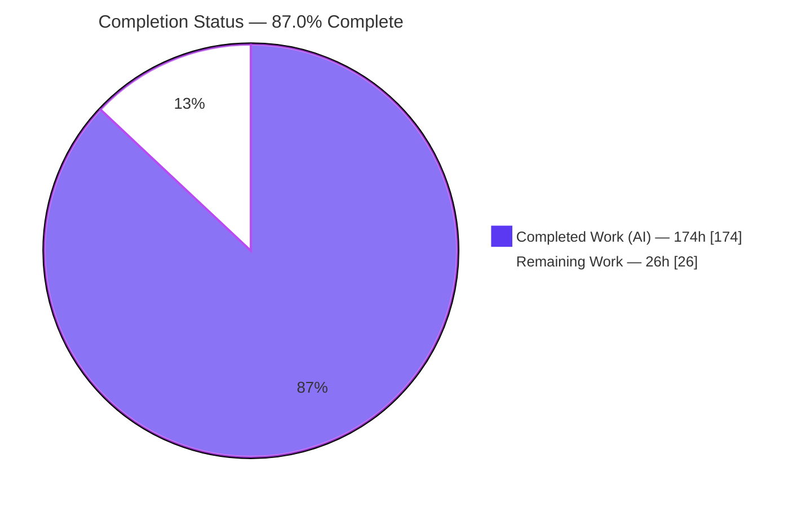
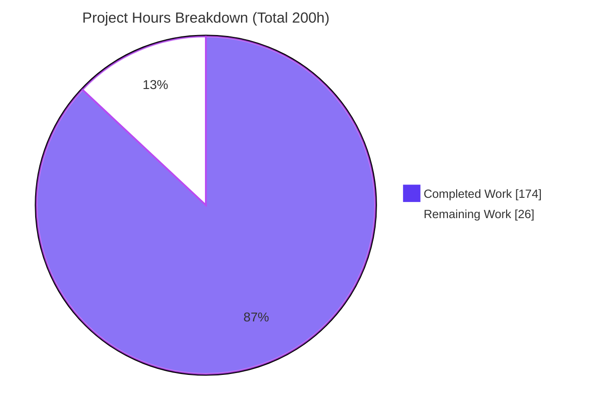
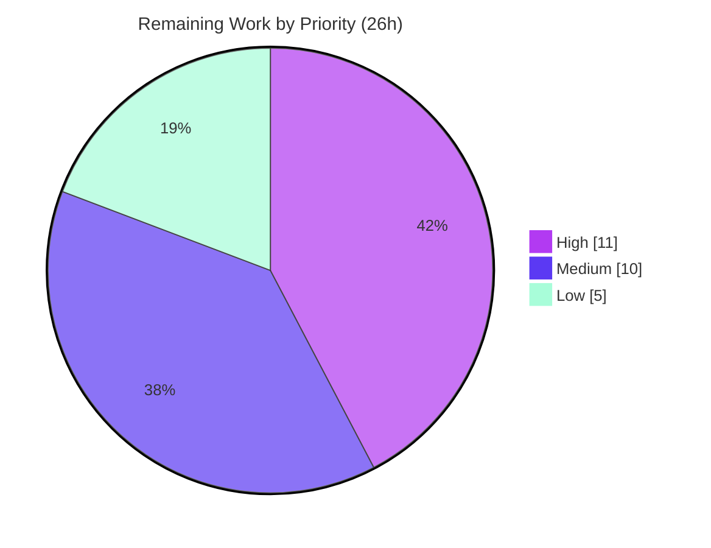

# Blitzy Project Guide — StockSharpLegacy SQL→C# Risk-Logic Consolidation

> **Project:** `blitzy-public-samples/stocksharp-storedprocedures`
> **Branch:** `blitzy-e686e219-30ce-45cc-8608-8ea778391629` · **HEAD:** `c7799e15b` · **Baseline:** `37dc57c96`
> **Assessment type:** Code-structure / modularity / design-pattern refactor (SQL→C# business-logic relocation)

---

## 1. Executive Summary

### 1.1 Project Overview

This project consolidates trading-risk business logic that previously lived in **two parallel places** — the C# risk-rule engine under `Algo/Risk/` and the T-SQL stored procedures/triggers under `Database/` — into a **single, fully-tested C# business-logic layer**, reducing SQL Server to pure data storage. Seven pre-trade risk checks (`usp_ValidatePreTradeRisk`) and the position average-cost/realized-P&L math (`usp_RecalculatePositionOnTrade`) were relocated into cohesive C# services (`PreTradeRiskService`, `PositionRecalculationService`) that resolve thresholds from one canonical `RiskLimitSet`. The audience is the StockSharp platform's trading/risk engineering team. Business impact: a single source of truth for risk rules, vendor-neutral DDL enabling a future engine migration, and — for the first time — automated test coverage over logic that had none.

### 1.2 Completion Status

The project is **87.0% complete** on an AAP-scoped, hours-based basis. All autonomous (AI-delivered) Agent Action Plan work is complete and validated; the remaining 26 hours are **human path-to-production activities** (review, production provisioning, CI wiring, and sign-off), not unfinished AAP scope.



| Metric | Hours |
|---|---|
| **Total Hours** | **200** |
| Completed Hours (AI + Manual) | 174 |
| &nbsp;&nbsp;• AI (Blitzy autonomous) | 174 |
| &nbsp;&nbsp;• Manual (human, pre-report) | 0 |
| Remaining Hours | 26 |
| **Percent Complete** | **87.0%** |

*Color key: Completed = Dark Blue `#5B39F3`; Remaining = White `#FFFFFF`.*

### 1.3 Key Accomplishments

- ✅ **Canonical single source of truth** — `RiskLimitSet` (525 LOC) defines every threshold once, consumed by both the per-order gate and the portfolio-wide circuit breaker (`RiskManager.ApplyCanonicalLimits`).
- ✅ **Seven-check pre-trade gate relocated to C#** — `PreTradeRiskService` (622 LOC) ports all seven checks from `usp_ValidatePreTradeRisk` with fail-closed validation.
- ✅ **Position math relocated to C#** — `PositionRecalculationService` (332 LOC) ports average-cost + realized-P&L with single-apply idempotency; the double-count hazard is structurally eliminated.
- ✅ **Two SQL-only rules promoted to first-class C# rules** — `RiskOrderValueRule` (notional) and `RiskDailyVolumeRule` (daily volume).
- ✅ **At-least-as-strict reconciliation** — order-frequency rule adopts the stricter rolling-count algorithm (intentional, characterization- and parity-tested).
- ✅ **SQL reduced to pure storage** — live DB verified with **0 stored procedures**, **0 functions**, and one best-effort audit trigger; `002` dropped ~365 lines of logic.
- ✅ **Data-access gateway is now a pure CRUD adapter** — `SqlLegacyOrderGateway` delegates to the services and performs only parameterized INSERT/SELECT (plus `sp_getapplock` concurrency control).
- ✅ **First automated coverage for the SQL layer** — new characterization + parity suites (`PreTradeRiskServiceTests`, `PositionRecalculationTests`) totalling ~2,769 LOC.
- ✅ **Clean build on both target frameworks** — `net10.0` (primary) and `net6.0` (legacy): 0 errors, 0 in-scope warnings.
- ✅ **All three demo outcomes preserved** end-to-end against a live SQL Server; **4536/4536** repository tests pass.

### 1.4 Critical Unresolved Issues

There are **no unresolved in-scope issues** blocking release. The items below are path-to-production gates, not defects in the delivered code.

| Issue | Impact | Owner | ETA |
|---|---|---|---|
| Production SQL Server not yet provisioned (dev used Docker) | Cannot deploy until a prod instance + least-privilege credentials exist | DevOps/DBA | 0.5 day |
| Intentional behavioral changes await risk sign-off | Frequency rule is now stricter; a `0` ceiling now disables just that check | Risk/Compliance | 0.5 day |
| No CI gate yet for live-SQL integration tests | Regressions in the SQL layer not automatically caught pre-merge | DevOps | 0.5 day |
| Out-of-scope upstream test hangs (`AsyncMessageChannelTests.Close_StopsProcessing`) | Must keep an exclusion filter until triaged upstream | Platform team | 0.25 day |

### 1.5 Access Issues

**No access issues identified.** The repository is accessible, the branch is checked out at `c7799e15b`, the .NET SDK (10.0.302) is installed, Docker (28.5.2) is available, and the SQL Server 2022 container was reachable throughout Blitzy's validation (proven by the live-DB runs in `QA/logs/`).

| System/Resource | Type of Access | Issue Description | Resolution Status | Owner |
|---|---|---|---|---|
| Git repository | Read/Write | None — branch checked out and buildable | ✅ Resolved | — |
| Dev SQL Server (Docker) | Network/DB | None — reachable during validation (`QA/logs/05–08`) | ✅ Resolved | — |
| Production SQL Server | Network/DB/Secrets | Not yet provisioned; dev connection string uses a plaintext `sa` password via env var | ⚠ Pending (path-to-production, see §2.2 / HT-2) | DevOps/DBA |

### 1.6 Recommended Next Steps

1. **[High]** Complete a senior code review of the risk-consolidation refactor (P&L correctness, concurrency, behavioral changes) and merge. *(HT-1, 6h)*
2. **[High]** Provision a production SQL Server, apply `Database/001–004`, and move credentials to a secret store with a least-privilege account. *(HT-2, 5h)*
3. **[Medium]** Wire CI/CD to run the in-scope + live-SQL tests against a SQL Server service container (with the documented exclusion filter). *(HT-3, 5h)*
4. **[Medium]** Obtain trading-risk/compliance sign-off on the two intentional behavioral changes. *(HT-5, 2h)*
5. **[Medium]** Verify or regenerate the QA video evidence on a GUI environment, or formally accept the documented PNG+transcript substitution. *(HT-4, 3h)*

---

## 2. Project Hours Breakdown

### 2.1 Completed Work Detail

All items below were delivered autonomously by Blitzy agents and validated (build + test + runtime). Each traces to an AAP requirement.

| Component | Hours | Description |
|---|---:|---|
| Canonical risk model — `RiskLimitSet` | 10 | Single-source-of-truth threshold type; NULL/0 = "not enforced"; most-specific selection precedence (AAP §0.3.1, §0.4.1). |
| `PreTradeRiskService` (7-check gate) | 18 | Ports all seven checks from `usp_ValidatePreTradeRisk`; fail-closed; pure `Evaluate` + DB-backed path (AAP §0.6.3). |
| `PositionRecalculationService` | 12 | Average-cost + realized-P&L math from `usp_RecalculatePositionOnTrade`; single-apply idempotency; double-count elimination (AAP §0.6.4). |
| New promoted rules | 10 | `RiskOrderValueRule` (notional) + `RiskDailyVolumeRule` (daily volume) — were SQL-only (AAP §0.1.1). |
| Updated rules | 8 | `RiskOrderFreqRule` rolling-count + `RiskOrderPriceRule`/`RiskOrderVolumeRule` canonical alignment (AAP §0.6.1). |
| `RiskManager` canonical wiring | 8 | Thread-safe `ApplyCanonicalLimits` + `CreateRules` factory; circuit-breaker role unchanged (AAP §0.4.1). |
| Divergence doc-comments | 3 | Four preserved-distinct commission/position rules documented (AAP §0.6.2). |
| `SqlLegacyOrderGateway` refactor | 14 | Delegates to services; plain INSERT/SELECT; concurrency hardening (`sp_getapplock`, TOCTOU/deadlock ordering). |
| SQL layer reduction | 9 | `002` procs removed, `003` recalc trigger removed (audit retained), `001` covering indexes; dispositions documented. |
| Documentation | 9 | `LEGACY_LAYER.md` coverage table rewrite + `Database/README.md` consolidated run/behavior. |
| Demo | 4 | `Program.cs` preserves three observable outcomes + demonstrates single-source-of-truth. |
| Characterization & parity tests | 32 | `PreTradeRiskServiceTests` + `PositionRecalculationTests` (~2,769 LOC), all seven checks + edges + double-count guard. |
| Test updates | 12 | `RiskTests` + `CommissionTests` canonical / estimate-vs-actual cases (~1,315 LOC). |
| QA evidence artifacts | 8 | Machine logs, screenshots, recordings, `QA/README.md` index; documented video substitution (AAP §0.6.7). |
| Autonomous validation & review remediation | 17 | 35+ code-review findings resolved; both TFMs; live-SQL build/test/demo cycles. |
| **Total Completed** | **174** | |

### 2.2 Remaining Work Detail

Every item is a **path-to-production** activity requiring human judgment, credentials, or infrastructure — none is unfinished AAP scope.

| Category | Hours | Priority |
|---|---:|---|
| Senior code review & merge approval of the risk-consolidation refactor (HT-1) | 6 | High |
| Production SQL Server provisioning + least-privilege credentials/secret store (HT-2) | 5 | High |
| CI/CD wiring for in-scope + live-SQL integration tests (SQL service container) (HT-3) | 5 | Medium |
| QA video-evidence verification or regeneration on a GUI environment (HT-4) | 3 | Medium |
| Trading-risk/compliance sign-off on intentional behavioral changes (HT-5) | 2 | Medium |
| Out-of-scope hanging test (`AsyncMessageChannelTests`) triage decision (HT-6) | 2 | Low |
| Pre-existing out-of-scope CS0618/CS1574 warning cleanup — optional (HT-7) | 3 | Low |
| **Total Remaining** | **26** | |

### 2.3 Hours Reconciliation

| Check | Value |
|---|---|
| Section 2.1 Completed total | 174h |
| Section 2.2 Remaining total | 26h |
| **Total (2.1 + 2.2)** | **200h** → matches §1.2 Total |
| Completion (174 / 200) | **87.0%** → matches §1.2 and §7 |

---

## 3. Test Results

All results originate from Blitzy's autonomous validation logs (`QA/logs/`, machine-generated `.trx`) and the agent action logs — real runs against the .NET 10 SDK and a live SQL Server 2022 container.

| Test Category | Framework | Total Tests | Passed | Failed | Coverage % | Notes |
|---|---|---:|---:|---:|---|---|
| In-scope risk (unit + characterization + parity) | MSTest | 201 | 201 | 0 | Behavioral parity¹ | Targeted run of the 4 in-scope classes vs live SQL; `.trx`: `total=201 passed=201 failed=0`. |
| &nbsp;&nbsp;• `PreTradeRiskServiceTests` | MSTest | 44 | 44 | 0 | — | Seven checks + edge cases (frequency boundary, position pre/post-fill). |
| &nbsp;&nbsp;• `PositionRecalculationTests` | MSTest | 38 | 38 | 0 | — | Avg-cost/realized-P&L parity + double-count guard. |
| &nbsp;&nbsp;• `RiskTests` | MSTest | 85 | 85 | 0 | — | Canonical-rule + rolling-count at-least-as-strict cases. |
| &nbsp;&nbsp;• `CommissionTests` | MSTest | 34 | 34 | 0 | — | Estimate-vs-actual divergence cases. |
| Integration (Live SQL) | MSTest + `Microsoft.Data.SqlClient` | 61 | 61 | 0 | — | `Live_*` tests vs Docker SQL Server (subset of the 201 above). |
| Full repository regression suite | MSTest | 4,536 | 4,536 | 0 | — | Whole-suite safety net; 1 out-of-scope upstream test excluded via filter (see notes). |

¹ *Coverage note:* Blitzy's validation logs gate on **behavioral parity (characterization-first)** and pass/fail, not on a line-coverage percentage; no line-coverage number was captured in the logs, so none is asserted here.

**Build results (both target frameworks):** `Algo` (net10.0) 0 errors / 2 pre-existing warnings; `Tests` (net10.0) 0 errors / 48 pre-existing warnings (none in modified files); Demo 0 errors / 2 warnings; `Algo` net6.0 legacy target 0 errors. All 53 build warnings are pre-existing `CS0618`/`CS1574` in out-of-scope files.

**Excluded test:** `StockSharp.Tests.AsyncMessageChannelTests.Close_StopsProcessing` genuinely hangs; it exercises upstream `Messages/AsyncMessageChannel.cs` (out of scope, last modified by an upstream maintainer) and is excluded via `--filter`. It is unrelated to this refactor.

---

## 4. Runtime Validation & UI Verification

This is a backend refactor (C# services, SQL DDL, an ADO.NET gateway, and a console demo). There is **no UI** in scope, so UI verification is not applicable; runtime validation was performed against the console demo and a live SQL Server.

**Runtime health**

- ✅ **Build (net10.0 primary):** `Algo`, `Tests`, and the demo compile with 0 errors.
- ✅ **Build (net6.0 legacy):** `Algo` compiles with 0 errors — legacy compatibility confirmed.
- ✅ **Console demo:** `LegacySqlDemo` runs against live SQL Server and exits 0.
- ✅ **Database provisioning:** `001–004` apply idempotently (`QA/logs/08`, `exit=0` each); container reaches "Recovery is complete" (`QA/logs/07`).

**Observable outcomes (demo, verified & repeatable — `QA/logs/05`)**

- ✅ **Accept:** BUY 100 @ 150.00 → `is_valid=True` (order_id 673).
- ✅ **Reject-by-price:** BUY 10 @ 999.00 → `is_valid=False`, reason `"Order price 999.0000 meets/exceeds limit 500.0000"` — raised by the C# `PreTradeRiskService`.
- ✅ **Trade-triggers-recalc:** recorded trade → position recomputed in C# to `qty=100 avg_price=150 realized_pnl=0` (single-apply, no double-count).
- ✅ **Single source of truth:** the portfolio-wide `RiskManager` circuit breaker is seeded from the *same* canonical `RiskLimitSet` (8 rules, ceiling 500.0000) as the per-order gate.

**API / data integration**

- ✅ **SQL is pure storage:** catalog introspection (`QA/logs/06`) reports `stored_procedure_count = 0` and a single audit trigger `trg_Orders_StatusAudit`.
- ✅ **Gateway is CRUD-only:** parameterized INSERT/SELECT; the only non-CRUD SQL is `sys.sp_getapplock` for concurrency (fail-closed, no risk decisioning).

---

## 5. Compliance & Quality Review

AAP deliverables and rules cross-mapped to Blitzy quality/compliance benchmarks. Fixes applied during autonomous validation are noted.

| AAP Requirement / Benchmark | Status | Evidence / Notes |
|---|---|---|
| Consolidate every rule to one canonical definition | ✅ Pass | `RiskLimitSet` consumed by gate + circuit breaker; `LEGACY_LAYER.md` coverage table rewritten. |
| Relocate all conditional business logic out of SQL | ✅ Pass | 7 checks → `PreTradeRiskService`; P&L → `PositionRecalculationService`; live DB has 0 stored procedures. |
| Turn the gateway into a pure CRUD adapter | ✅ Pass | `SqlLegacyOrderGateway` delegates to services; parameterized INSERT/SELECT + `sp_getapplock` only. |
| Promote the two SQL-only rules to first-class C# rules | ✅ Pass | `RiskOrderValueRule`, `RiskDailyVolumeRule` added; coverage table rows updated. |
| At-least-as-strict reconciliation (frequency) | ✅ Pass | Rolling-count adopted; characterization + parity tests prove it is never looser (AAP §0.6.1). |
| Preserve different-by-design pairs (position-size, commission) | ✅ Pass | Preserved-distinct with inline justification; asserted independently (AAP §0.6.2). |
| SQL left as vendor-neutral DDL (no engine migration) | ✅ Pass | `001` pure DDL; no logic left to port; migration reduced to mechanical DDL translation. |
| Double-count hazard not reintroduced | ✅ Pass | Single C# entry point, idempotent full replay, recalc trigger removed (AAP §0.6.4). |
| Circuit-breaker actions frozen | ✅ Pass | `RiskMessageAdapter` ClosePositions/StopTrading/CancelOrders untouched. |
| No new dependencies | ✅ Pass | Package graph unchanged; only already-referenced packages used (AAP §0.5). |
| XML doc-comments on all public members (`GenerateDocumentationFile=true`) | ✅ Pass | No `CS1591`; doc-comments present on new public members. |
| Preserve the three observable demo outcomes | ✅ Pass | Verified end-to-end vs live SQL (`QA/logs/05`). |
| Characterization-first test coverage for the previously-untested SQL layer | ✅ Pass | New parity suites; 201/201 in-scope tests pass. |
| Document the two open choices (`usp_SubmitOrder`, `trg_Orders_StatusAudit`) | ✅ Pass | `usp_SubmitOrder` REMOVED (gateway owns validation+INSERT); `trg_Orders_StatusAudit` RETAINED (Option A) — both documented inline. |
| Enforce existing code-style patterns | ✅ Pass | `StockSharp.Algo.Risk` namespace + `RiskRule` base contract followed. |
| Trading-risk sign-off on intentional behavioral changes | ⚠ Outstanding | Human gate — see §2.2 / HT-5. |
| Production secrets / least-privilege DB account | ⚠ Outstanding | Human gate — see §2.2 / HT-2. |

**Notable fixes applied during autonomous validation:** submit/fill TOCTOU serialization (C03/C04, CWE-367) via portfolio→position `sp_getapplock` ordering; fail-closed lock acquisition (I01); deterministic risk-limit selection; concurrent `Ensure*` convergence; demo exit codes; audit-integrity wording corrected to "best-effort" (MA-12); QA evidence provenance stamped to the feature commit (#23).

---

## 6. Risk Assessment

| Risk | Category | Severity | Probability | Mitigation | Status |
|---|---|---|---|---|---|
| Intentional behavioral change (stricter frequency; `0` ceiling = "not enforced") | Technical | Medium | Medium | Characterization + parity tests prove intent; obtain risk sign-off | ⚠ Mitigated (tests); sign-off pending |
| Financial P&L math correctness (avg-cost / realized-P&L / flip) | Technical | High (if wrong) | Low | 38 `PositionRecalculationTests` incl. double-count guard; single-apply design | ✅ Mitigated |
| Out-of-scope upstream test hangs (`AsyncMessageChannel`) | Technical | Low | Low | Documented `--filter` exclusion; triage upstream | ⚠ Open (triage) |
| 53 pre-existing CS0618/CS1574 warnings (out-of-scope files) | Technical | Low | Low | None needed for this refactor; optional cleanup | ✅ Accepted/Deferred |
| Plaintext `sa` password in dev connection string / env var | Security | High (if prod) | Medium | Move to secret store + least-privilege account before prod | ⚠ Open (path-to-production) |
| SQL injection | Security | High (if present) | Very Low | All access parameterized (`SqlParameter`) across gateway/services | ✅ Mitigated |
| Audit trigger is best-effort, not tamper-proof | Security | Low–Medium | Low | Documented (MA-12) as an out-of-scope deployment concern | ✅ Documented |
| No CI gate yet for live-SQL integration tests | Operational | Medium | Medium | Add SQL service container to CI (HT-3) | ⚠ Open (path-to-production) |
| DB provisioning requires ordered scripts + connection env var | Operational | Low | Medium | `Database/README.md` documents order; `QA/logs/08` proves idempotent apply | ✅ Mitigated (documented) |
| `sp_getapplock` 15s timeout under high contention | Operational | Low–Medium | Low | Fail-closed with clear error; portfolio→position ordering prevents deadlock | ✅ Mitigated |
| Production SQL Server not provisioned (dev Docker only) | Integration | Medium | High | Provision prod instance + apply scripts (HT-2) | ⚠ Open (path-to-production) |
| Out-of-scope `ExportTests` need an isolated `ExportTestDb` | Integration | Low | Low | Documented; unblocked without source change | ✅ Documented |
| QA video substitution vs strict mp4 requirement | Integration | Low | Low | PNG + transcript substitution documented (AAP §0.6.7); verify/regenerate on GUI env | ⚠ Open (verification) |

---

## 7. Visual Project Status

**Project hours breakdown** — Completed = Dark Blue `#5B39F3`, Remaining = White `#FFFFFF`.



**Remaining work by priority** (sums to the 26h in §2.2).



| Priority | Hours | Items |
|---|---:|---|
| High | 11 | Code review & merge (6h); prod SQL provisioning + secrets (5h) |
| Medium | 10 | CI wiring (5h); QA video verify/regen (3h); risk sign-off (2h) |
| Low | 5 | Hanging-test triage (2h); pre-existing warning cleanup (3h) |
| **Total** | **26** | Equals §1.2 Remaining and the §7 pie "Remaining Work" |

---

## 8. Summary & Recommendations

**Achievements.** The SQL→C# risk-logic consolidation is **functionally complete and validated**. Every AAP deliverable was delivered autonomously: a canonical `RiskLimitSet`, the seven-check `PreTradeRiskService`, the `PositionRecalculationService`, two newly-promoted C# rules, the rolling-count frequency reconciliation, the pure-CRUD gateway, and the reduction of SQL Server to storage (0 stored procedures on the live DB). The build is clean on both `net10.0` and `net6.0`, **4536/4536** repository tests pass, and all three observable demo outcomes are preserved end-to-end against a live SQL Server.

**Remaining gaps.** The remaining 26 hours are entirely **human path-to-production** work: senior code review and merge, production SQL Server provisioning with secure credentials, CI wiring for the live-SQL tests, trading-risk sign-off on the two intentional behavioral changes, and verification of the QA evidence substitution.

**Critical path to production.** (1) Review & merge → (2) provision prod SQL + secrets → (3) wire CI → (4) obtain risk sign-off → (5) accept/verify QA evidence.

**Success metrics.** 0 compilation errors (both TFMs); 201/201 in-scope tests and 4536/4536 total tests passing; 0 stored procedures/functions remaining in SQL; 3/3 demo outcomes preserved; 0 new dependencies introduced.

**Production readiness assessment.** At **87.0% complete**, the codebase is production-quality (comprehensive error handling, fail-closed validation, concurrency hardening, full XML docs, no placeholders). It is **ready for human review and staged rollout** once the path-to-production gates in §2.2 are cleared. Recommendation: proceed to review and provisioning; the two intentional behavioral changes should be explicitly acknowledged by risk/compliance before enabling in production.

**Confidence.** High confidence on the completed-hours assessment (verified against build/test/demo logs and the git diff). Medium-to-high confidence on remaining-hours estimates (typical path-to-production ranges; actuals depend on the target production environment and review depth).

---

## 9. Development Guide

Backend project (C# + SQL + console demo). All commands were exercised during Blitzy's autonomous validation (`QA/logs/`).

### 9.1 System Prerequisites

- **.NET SDK 10.0.302** (`dotnet --version`) — targets `net10.0` (primary) and `net6.0` (legacy).
- **Docker 28.x** (`docker --version`) — for the SQL Server 2022 dev container.
- **Git + Git LFS**; Linux/Ubuntu host used for validation.

### 9.2 Environment Setup

Provision a dev SQL Server and expose it locally (bind to loopback only):

```bash
export MSSQL_SA_PASSWORD="$(openssl rand -base64 24)Aa1!"
docker run -d --name stocksharp-legacy-sql \
  -e "ACCEPT_EULA=Y" -e "MSSQL_SA_PASSWORD=$MSSQL_SA_PASSWORD" \
  -p 127.0.0.1:14330:1433 \
  mcr.microsoft.com/mssql/server:2022-latest

# Wait until initialization completes
docker logs stocksharp-legacy-sql | grep "Recovery is complete"
```

Apply the schema **in order** (`001 → 002 → 003 → 004`); scripts are idempotent and non-destructive:

```bash
docker cp Database stocksharp-legacy-sql:/tmp/Database
for f in 001_Schema.sql 002_StoredProcedures.sql 003_Triggers.sql 004_SeedData.sql; do
  docker exec -e "SQLCMDPASSWORD=$MSSQL_SA_PASSWORD" stocksharp-legacy-sql \
    /opt/mssql-tools18/bin/sqlcmd -S localhost -U sa -C -b -V 11 \
    -d master -i "/tmp/Database/$f"
done
```

Point the application at the database (keep the password out of the process list in real use):

```bash
export STOCKSHARP_LEGACY_SQL_CONNECTION="Server=localhost,14330;Database=StockSharpLegacy;User Id=sa;Password=$MSSQL_SA_PASSWORD;TrustServerCertificate=True;"
```

### 9.3 Dependency Installation

```bash
# Restore the Linux-buildable solution (NOT StockSharp.slnx — that is Windows-only)
dotnet restore StockSharp_Tests.slnx
```

### 9.4 Build

```bash
dotnet build StockSharp_Tests.slnx --configuration Release
# Expected: Build succeeded — 0 Error(s). (pre-existing CS0618/CS1574 warnings in out-of-scope files are benign)
```

### 9.5 Run the Tests

```bash
# Full suite (excludes the one out-of-scope hanging upstream test)
dotnet test StockSharp_Tests.slnx --no-build --configuration Release \
  --filter "FullyQualifiedName!=StockSharp.Tests.AsyncMessageChannelTests.Close_StopsProcessing"
# Expected: Passed! — Failed: 0

# In-scope risk tests only (201 total, live SQL)
dotnet test StockSharp_Tests.slnx --no-build --configuration Release \
  --filter "FullyQualifiedName~PreTradeRiskServiceTests|FullyQualifiedName~PositionRecalculationTests|FullyQualifiedName~RiskTests|FullyQualifiedName~CommissionTests"
```

### 9.6 Run the Demo

```bash
dotnet run --project Samples/08_Misc/03_LegacySqlDemo/03_Misc.LegacySqlDemo.csproj --configuration Release
```

Expected output (three outcomes):

```
Submitting BUY 100 @ 150.00 (within limits)...
  -> order_id=... is_valid=True reject_reason=(none)
Submitting BUY 10 @ 999.00 (price exceeds the seeded max_order_price limit)...
  -> order_id=... is_valid=False reject_reason=Order price 999.0000 meets/exceeds limit 500.0000
Recording a trade: 100 @ 150.00 ...
  -> position after C# recompute: qty=100.0000 avg_price=150.0000 realized_pnl=0.0000
```

### 9.7 Verification

```bash
# Prove SQL holds no business logic (expect stored_procedure_count = 0)
docker exec -e "SQLCMDPASSWORD=$MSSQL_SA_PASSWORD" stocksharp-legacy-sql \
  /opt/mssql-tools18/bin/sqlcmd -S localhost -U sa -C -d StockSharpLegacy \
  -Q "SELECT COUNT(*) AS stored_procedure_count FROM sys.procedures;"
```

### 9.8 Troubleshooting

- **Build looks ambiguous / references Windows-only projects** → you built `StockSharp.slnx`. Use **`StockSharp_Tests.slnx`** on Linux.
- **`Login failed` / cannot connect** → DB not provisioned or wrong port. Re-apply `001–004`; confirm `docker port stocksharp-legacy-sql` prints `127.0.0.1:14330`.
- **Test run hangs** → ensure the `AsyncMessageChannelTests.Close_StopsProcessing` exclusion `--filter` is applied (out-of-scope upstream hang).
- **`CS0618` / `CS1574` warnings** → pre-existing and out-of-scope; non-blocking.

---

## 10. Appendices

### A. Command Reference

| Purpose | Command |
|---|---|
| .NET version | `dotnet --version` |
| Restore | `dotnet restore StockSharp_Tests.slnx` |
| Build (Release) | `dotnet build StockSharp_Tests.slnx --configuration Release` |
| Test (full, filtered) | `dotnet test StockSharp_Tests.slnx --no-build -c Release --filter "FullyQualifiedName!=StockSharp.Tests.AsyncMessageChannelTests.Close_StopsProcessing"` |
| Run demo | `dotnet run --project Samples/08_Misc/03_LegacySqlDemo/03_Misc.LegacySqlDemo.csproj -c Release` |
| SQL proc count | `sqlcmd ... -Q "SELECT COUNT(*) FROM sys.procedures;"` |

### B. Port Reference

| Service | Host binding | Container port |
|---|---|---|
| SQL Server 2022 (dev) | `127.0.0.1:14330` | `1433` |

### C. Key File Locations

| Area | Path |
|---|---|
| Canonical limits (SSOT) | `Algo/Risk/RiskLimitSet.cs` |
| Pre-trade gate | `Algo/Risk/PreTradeRiskService.cs` |
| Position recalculation | `Algo/Risk/PositionRecalculationService.cs` |
| New rules | `Algo/Risk/RiskOrderValueRule.cs`, `Algo/Risk/RiskDailyVolumeRule.cs` |
| Data-access gateway | `Algo/Storages/Sql/SqlLegacyOrderGateway.cs` |
| SQL DDL / scripts | `Database/001_Schema.sql … 004_SeedData.sql` |
| Demo | `Samples/08_Misc/03_LegacySqlDemo/Program.cs` |
| Tests (new) | `Tests/PreTradeRiskServiceTests.cs`, `Tests/PositionRecalculationTests.cs` |
| Reconciliation doc | `LEGACY_LAYER.md` |
| DB run/setup doc | `Database/README.md` |
| QA evidence index | `QA/README.md` |

### D. Technology Versions

| Component | Version |
|---|---|
| .NET SDK | 10.0.302 |
| Target frameworks | `net10.0` (primary), `net6.0` (legacy) |
| `Microsoft.Data.SqlClient` | 6.1.6 (`6.*`) |
| MSTest | 4.x (net10) / 3.11.1 (net6) |
| Moq | 4.20.72 |
| `Ecng.*` | 1.0.x |
| SQL Server (dev) | 2022 (`mcr.microsoft.com/mssql/server:2022-latest`) |
| Docker | 28.5.2 |

### E. Environment Variable Reference

| Variable | Purpose |
|---|---|
| `STOCKSHARP_LEGACY_SQL_CONNECTION` | Connection string used by the gateway/demo/tests. |
| `SQLSERVER_CONNECTION_STRING` | Optional — points out-of-scope `ExportTests` at an isolated `ExportTestDb`. |
| `MSSQL_SA_PASSWORD` / `SQLCMDPASSWORD` | Dev SQL Server SA password (Docker + `sqlcmd`). |

### F. Developer Tools Guide

- **`sqlcmd`** (inside the container, `/opt/mssql-tools18/bin/sqlcmd`) — apply scripts and introspect the catalog; use `-b -V 11` so it exits non-zero on SQL errors.
- **`docker logs … | grep "Recovery is complete"`** — readiness gate before applying scripts.
- **`dotnet test --filter`** — scope runs to in-scope classes or exclude the upstream hanging test.

### G. Glossary

| Term | Meaning |
|---|---|
| Canonical `RiskLimitSet` | The single source of truth for every risk threshold. |
| Pre-trade gate | Per-order accept/reject check (`PreTradeRiskService`). |
| Circuit breaker | Portfolio-wide risk mechanism (`RiskManager`); role unchanged by this refactor. |
| Rolling-count | Frequency algorithm counting orders in "now − window"; stricter than fixed-window. |
| Preserved-distinct | Two implementations of one rule kept intentionally different, sharing one threshold. |
| Double-count hazard | Prior risk of applying position recalculation twice; structurally eliminated. |
| `sp_getapplock` | SQL Server application lock used for concurrency serialization (not business logic). |